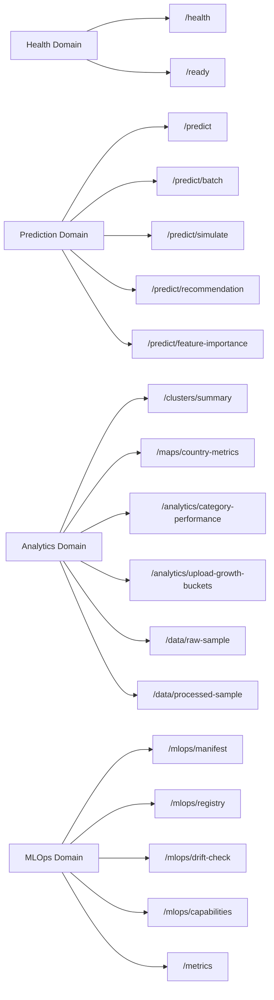
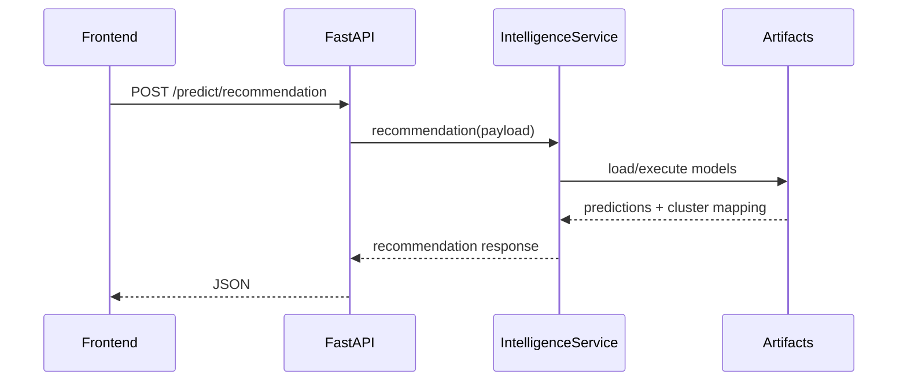
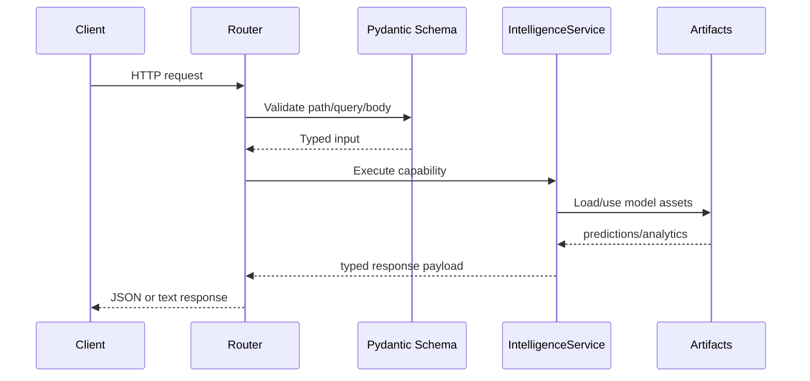
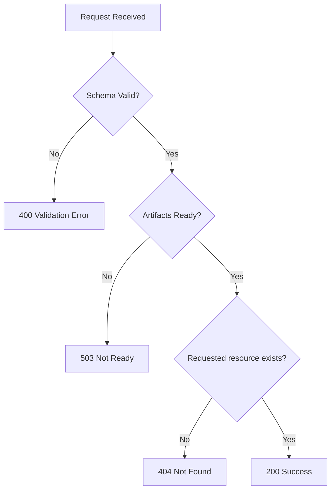

# API Reference - YouTube Success Prediction ML Platform

Below is the API reference for the YouTube Success Intelligence Service, detailing available endpoints, request/response contracts, and operational semantics.

## Table Of Contents

- [Document Metadata](#document-metadata)
- [Documentation Map](#documentation-map)
- [Endpoint Map](#endpoint-map)
- [Endpoint Domains](#endpoint-domains)
- [Core Contracts](#core-contracts)
- [Lifecycle Sequence](#lifecycle-sequence)
- [Validation And Execution Pipeline](#validation-and-execution-pipeline)
- [Response Decision Tree](#response-decision-tree)
- [Payload Constraints Summary](#payload-constraints-summary)
- [Operational Notes](#operational-notes)
- [Error Semantics](#error-semantics)

## Document Metadata

| Field | Value |
| --- | --- |
| Document role | API contract and integration authority |
| Primary audience | Frontend engineers, backend engineers, QA engineers, integrators |
| Last updated | February 18, 2026 |
| Runtime scope | FastAPI (`:8000`) and Flask (`:5000`) |
| Contract owner | API/platform engineering |

## Documentation Map

| Document | Scope | Use it when |
| --- | --- | --- |
| [`README.md`](README.md) | Operational setup and runbook | You need quick start and smoke test commands |
| [`ARCHITECTURE.md`](ARCHITECTURE.md) | Cross-component request flow | You need service boundaries and sequence context |
| [`MLOPS.md`](MLOPS.md) | Model lineage and drift policy | You need lifecycle and governance constraints |
| [`DEPLOYMENT.md`](DEPLOYMENT.md) | Runtime rollout topology | You need environment and deployment strategy details |
| [`FRONTEND.md`](FRONTEND.md) | Client route/API wiring | You need UI integration expectations by page |

Base URL:

- FastAPI: `http://localhost:8000`
- Flask: `http://localhost:5000`

## Endpoint Map


## Endpoint Domains



## Core Contracts

### POST `/predict`

Request:

```json
{
  "uploads": 500,
  "category": "Education",
  "country": "United States",
  "age": 6
}
```

Response:

```json
{
  "predicted_subscribers": 24000000.0,
  "predicted_earnings": 4300000.0,
  "predicted_growth": 110000.0
}
```

### POST `/predict/batch`

Request:

```json
{
  "items": [
    {"uploads": 200, "category": "Education", "country": "United States", "age": 4},
    {"uploads": 1200, "category": "Entertainment", "country": "India", "age": 8}
  ]
}
```

Response:

```json
{
  "records": [
    {"predicted_subscribers": 1, "predicted_earnings": 1, "predicted_growth": 1}
  ],
  "summary": {
    "count": 2,
    "avg_predicted_subscribers": 1,
    "avg_predicted_earnings": 1,
    "avg_predicted_growth": 1
  }
}
```

### POST `/predict/simulate`

Request:

```json
{
  "category": "Music",
  "country": "India",
  "age": 7,
  "start_uploads": 100,
  "end_uploads": 1000,
  "step": 100
}
```

Response includes simulation points and best upload count by growth/earnings.

### POST `/predict/recommendation`

Returns:

- prediction object
- projected archetype cluster
- risk level (`low|medium|high`)
- actionable recommendation list

### GET `/predict/feature-importance`

Query:

- `target` in `subscribers|earnings|growth`
- `top_n` in `1..50`

### POST `/mlops/drift-check`

Request:

```json
{
  "items": [
    {"uploads": 500, "category": "Education", "country": "United States", "age": 6}
  ],
  "z_threshold": 3.0,
  "min_category_frequency": 0.01
}
```

Response:

- summary (`is_drift_risk`, high severity count)
- per-record warnings and severity

### GET `/mlops/capabilities`

Returns runtime visibility into installed/available MLOps extensions:

- experiment tracking backend availability (`mlflow`, `wandb`)
- HPO engine availability (`optuna`)
- feature store/data versioning assets (`dvc`, `feast` repository)
- orchestration assets (Prefect flow presence)
- monitoring asset presence (Prometheus/Grafana configs)

### GET `/analytics/category-performance`

Query:

- `top_n` in `3..30`

Returns category-level aggregated performance records including average growth, average earnings, and totals.

### GET `/analytics/upload-growth-buckets`

Returns grouped records by upload buckets with average growth/earnings/subscribers and channel counts.

## Lifecycle Sequence



## Validation And Execution Pipeline



## Response Decision Tree



## Payload Constraints Summary

- `uploads`: `0..2,000,000`
- `age`: `0..100`
- batch list length: `1..500`
- raw sample endpoint limit: `1..200`
- processed sample endpoint limit: `1..1000`
- category performance `top_n`: `3..30`
- simulation step: `1..200,000`
- feature importance `top_n`: `1..50`

## Operational Notes

- `/ready` should be used by orchestration health checks.
- `/metrics` exposes Prometheus-friendly counters and latency sums.
- `/mlops/drift-check` depends on `training_baseline.json`; returns `503` when missing.

## Error Semantics

- `400`: validation error, malformed payload, invalid query params
- `404`: missing manifest/registry
- `503`: artifacts or baseline not ready
- `200`: successful request
