# Architecture Document: YouTube Success Prediction ML Platform


## Table Of Contents

- [Document Metadata](#document-metadata)
- [Documentation Map](#documentation-map)
- [1. Purpose](#1-purpose)
- [2. Scope](#2-scope)
- [3. Architectural Goals](#3-architectural-goals)
- [4. High-Level System Context](#4-high-level-system-context)
- [5. Container View](#5-container-view)
- [6. Component View: Backend](#6-component-view-backend)
- [7. Data Flow: Training Lifecycle](#7-data-flow-training-lifecycle)
- [8. Data Flow: Inference Request Lifecycle](#8-data-flow-inference-request-lifecycle)
- [9. Data Layer And Feature Engineering](#9-data-layer-and-feature-engineering)
- [9.1 Dataset Overview](#91-dataset-overview)
- [9.2 Canonical Transformation Rules](#92-canonical-transformation-rules)
- [9.3 Raw vs Processed Contracts](#93-raw-vs-processed-contracts)
- [10. Modeling Architecture](#10-modeling-architecture)
- [11. API Design](#11-api-design)
- [12. Frontend Architecture](#12-frontend-architecture)
- [13. MLOps Architecture](#13-mlops-architecture)
- [14. Observability](#14-observability)
- [15. Reliability And Failure Modes](#15-reliability-and-failure-modes)
- [16. Security Posture](#16-security-posture)
- [17. Deployment Topology](#17-deployment-topology)
- [18. CI/CD Model](#18-cicd-model)
- [19. Capacity And Scalability Notes](#19-capacity-and-scalability-notes)
- [20. Decisions And Tradeoffs](#20-decisions-and-tradeoffs)
- [21. Suggested Enterprise Evolution Path](#21-suggested-enterprise-evolution-path)
- [22. Source File Index](#22-source-file-index)
- [23. Operational Checklist](#23-operational-checklist)
- [24. Extended Interaction Charts](#24-extended-interaction-charts)
- [25. Data Contracts By Layer](#25-data-contracts-by-layer)
- [26. Deployment Variants](#26-deployment-variants)
- [27. Incident Response Flow](#27-incident-response-flow)
- [28. Trust Boundaries And Data Zones](#28-trust-boundaries-and-data-zones)
- [29. Model Promotion And Rollback Design](#29-model-promotion-and-rollback-design)
- [30. Request Routing By Capability](#30-request-routing-by-capability)
- [31. Multi-Cloud Platform Topology](#31-multi-cloud-platform-topology)
- [32. Strategy Control Plane](#32-strategy-control-plane)
- [33. Terraform Composition Model](#33-terraform-composition-model)
- [34. Release Promotion Sequence](#34-release-promotion-sequence)
- [35. Rollback And Recovery Path](#35-rollback-and-recovery-path)
- [36. Non-Functional Requirements Matrix](#36-non-functional-requirements-matrix)
- [37. Architecture Governance](#37-architecture-governance)

## Document Metadata

| Field | Value |
| --- | --- |
| Document role | System architecture and engineering design authority |
| Primary audience | Senior ML/backend/frontend/platform engineers and technical reviewers |
| Last updated | February 18, 2026 |
| Operational companion | [`README.md`](README.md) |
| Contract companion | [`API_REFERENCE.md`](API_REFERENCE.md) |

## Documentation Map

| Document | Scope | Use it when |
| --- | --- | --- |
| [`README.md`](README.md) | Operational bootstrap and runbook | You need setup, quality gates, and execution commands |
| [`API_REFERENCE.md`](API_REFERENCE.md) | Endpoint contracts and constraints | You need payload semantics and error behavior |
| [`MLOPS.md`](MLOPS.md) | Lineage and governance operations | You need manifest/registry/drift details |
| [`DEPLOYMENT.md`](DEPLOYMENT.md) | Delivery and rollout strategy | You need CI/CD and release orchestration guidance |
| [`FRONTEND.md`](FRONTEND.md) | Client routes and API consumption model | You need frontend integration boundaries |
| [`infra/README.md`](infra/README.md) | Infrastructure topology index | You need infra-level navigation and quick commands |
| [`infra/k8s/README.md`](infra/k8s/README.md) | Kubernetes runtime objects | You are changing manifests, policies, or overlays |
| [`infra/argocd/README.md`](infra/argocd/README.md) | GitOps application control | You are switching sync strategy or app definitions |
| [`infra/terraform/README.md`](infra/terraform/README.md) | Cloud provisioning model | You are planning/applying infrastructure packs |

## 1. Purpose

This document describes the technical architecture of the YouTube Success Prediction ML Platform. It covers:

- system boundaries
- runtime components
- data and model lifecycles
- API and frontend integration
- MLOps lineage and observability
- operational reliability patterns

The architecture is designed to be portfolio-grade while staying executable in a local environment.

## 2. Scope

### In Scope

- Supervised inference for subscriber/earnings/growth predictions.
- Unsupervised clustering and archetype labeling.
- Country-level metrics and visualization-ready data delivery.
- FastAPI and Flask runtime services.
- Next.js frontend for interactive analytics.
- Training-time MLOps artifacts and registry.

### Out Of Scope

- multi-tenant identity and RBAC.
- distributed retraining orchestration.
- online feature store.
- managed model serving platform.

## 3. Architectural Goals

- Reproducibility: deterministic training metadata and artifact hashes.
- Operability: health/readiness endpoints plus metrics exposure.
- Modularity: clear separation between data, modeling, API, and UI layers.
- Replaceability: model and serving layers can evolve independently.
- Traceability: each training run tied to data fingerprint and config snapshot.

## 4. High-Level System Context

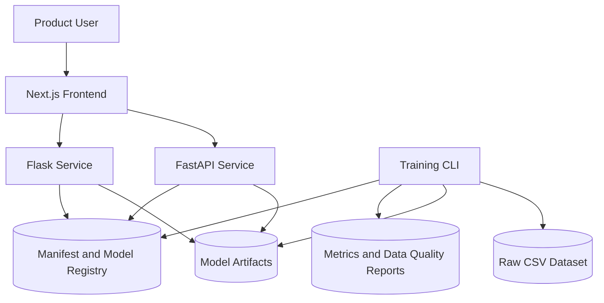

## 5. Container View

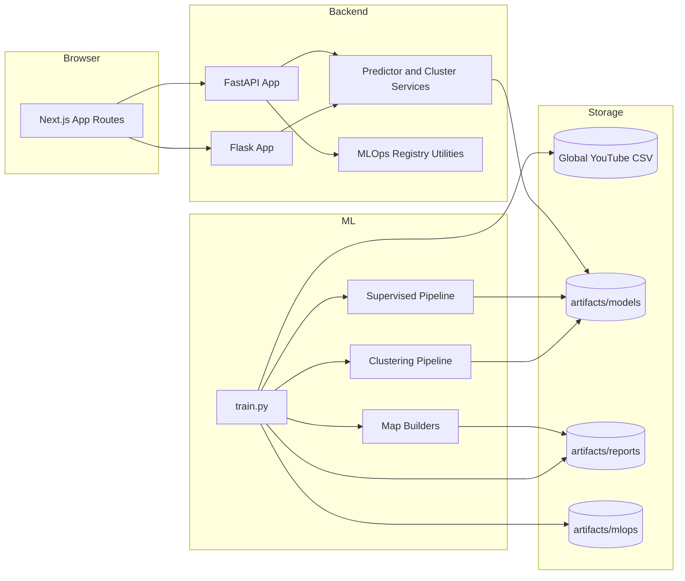

## 6. Component View: Backend

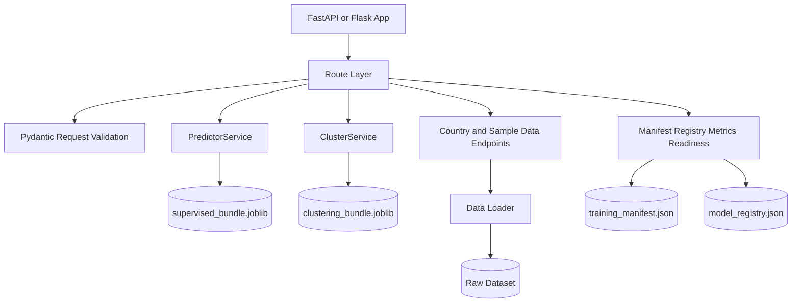

## 7. Data Flow: Training Lifecycle

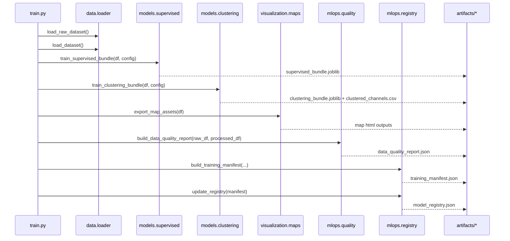

## 8. Data Flow: Inference Request Lifecycle

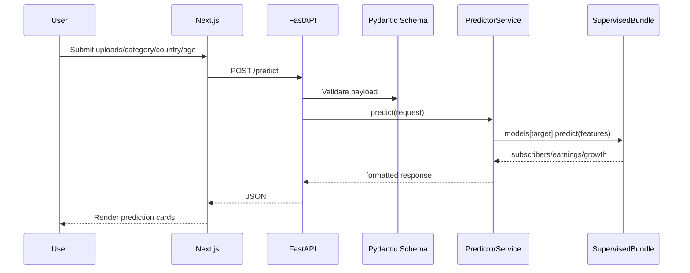

## 9. Data Layer And Feature Engineering

### 9.1 Dataset Overview

Primary source dataset:

- path resolution: `resolve_data_path()` in `src/youtube_success_ml/data/loader.py`
- default source file: `data/Global YouTube Statistics.csv`
- optional override: `YTS_DATA_PATH`
- encoding: `latin-1`
- row count: `995`
- raw column count: `28`

Processed training frame:

- row count: `995`
- processed column count: `30`
- engineered columns include `age` and `growth_target`

Dataset domains:

| Domain | Examples |
| --- | --- |
| Channel identity and taxonomy | `youtuber`, `title`, `channel_type`, `category`, `country`, `abbreviation` |
| Core performance | `uploads`, `subscribers`, `video_views`, `video_views_for_the_last_30_days` |
| Monetization | `lowest_monthly_earnings`, `highest_monthly_earnings`, `lowest_yearly_earnings`, `highest_yearly_earnings` |
| Growth and lifecycle | `subscribers_for_last_30_days`, `created_year`, `created_month`, `created_date`, engineered `age`, engineered `growth_target` |
| Geo and socio-economic context | `latitude`, `longitude`, `population`, `urban_population`, `unemployment_rate`, `gross_tertiary_education_enrollment_pct` |

Feature/target contract for supervised inference:

- features: `uploads`, `category`, `country`, `age`
- targets: `subscribers`, `highest_yearly_earnings`, `growth_target`

### 9.2 Canonical Transformation Rules

Defined in `src/youtube_success_ml/data/loader.py`:

- normalize column names to snake_case.
- coerce known numeric columns with `errors='coerce'`.
- fill `country`, `category`, `abbreviation` nulls.
- engineer `age = current_year - created_year` clipped to non-negative.
- derive `growth_target = subscribers_for_last_30_days`.
- enforce non-negative clipping for key numeric targets.

### 9.3 Raw vs Processed Contracts

- raw contract endpoint: `/data/raw-sample`
- processed contract endpoint: `/data/processed-sample`

This split makes preprocessing explicit to product and stakeholders.

## 10. Modeling Architecture

### Supervised Stack

Implementation: `src/youtube_success_ml/models/supervised.py`

- Feature pipeline:
  - numeric imputation for `uploads` and `age`
  - categorical imputation and one-hot encoding for `category` and `country`
- Regressor:
  - `RandomForestRegressor`
- Target transform:
  - `TransformedTargetRegressor` with `log1p/expm1`
- Targets:
  - subscribers
  - yearly earnings
  - 30-day growth
- Evaluation metrics:
  - MAE
  - RMSE
  - R2

### Clustering Stack

Implementation: `src/youtube_success_ml/models/clustering.py`

- KMeans pipeline:
  - `StandardScaler` + `KMeans`
- DBSCAN pipeline:
  - `StandardScaler` + `DBSCAN`
- Profile generation:
  - aggregate per cluster (`avg_uploads`, `avg_subscribers`, `avg_earnings`, `avg_growth`)
- Archetype naming logic:
  - highest growth => `Viral entertainers`
  - highest earnings per upload => `High earning low upload`
  - high uploads relative to growth => `High upload low growth`
  - remaining => `Consistent educators`

## 11. API Design

### FastAPI Endpoints

- `GET /health`
- `GET /ready`
- `POST /predict`
- `POST /predict/batch`
- `POST /predict/simulate`
- `POST /predict/recommendation`
- `GET /predict/feature-importance`
- `GET /clusters/summary`
- `GET /maps/country-metrics`
- `GET /data/raw-sample`
- `GET /data/processed-sample`
- `GET /analytics/category-performance`
- `GET /analytics/upload-growth-buckets`
- `GET /mlops/manifest`
- `GET /mlops/registry`
- `POST /mlops/drift-check`
- `GET /metrics`

### Flask Endpoints

Equivalent functional prediction, analytics, and MLOps endpoints are exposed via Flask for framework portability.
Prometheus-style metrics are implemented in FastAPI.

### Readiness Strategy

`/ready` checks artifact existence through `check_artifacts_ready()`.

If critical artifacts are missing, service reports not-ready state, allowing load balancers or orchestrators to block traffic.

## 12. Frontend Architecture

### Routes

- `/` main dashboard
- `/visualizations/charts` analytics + raw/processed data comparisons
- `/intelligence/lab` simulation, recommendation, feature importance, and drift analysis
- `/wiki` embedded project wiki route
- `/wiki/index.html` standalone static wiki landing page

### Client Data Access

`frontend/lib/api.ts` centralizes typed API requests and transport error handling.

### UI Composition

- composable chart + table sections
- typed data contracts in `frontend/lib/types.ts`
- progressive loading and error display for asynchronous calls
- dedicated responsive navigation and layout shell for desktop/mobile parity

### SEO And Metadata Integration

- global metadata and social previews in `frontend/app/layout.tsx`
- robots and sitemap generation in `frontend/app/robots.ts` and `frontend/app/sitemap.ts`
- web manifest in `frontend/app/manifest.ts`
- favicon and icon asset pipeline via `frontend/public/`

## 13. MLOps Architecture

### Artifact Lineage

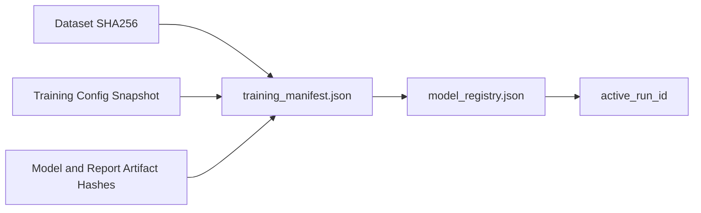

### Outputs

- metrics report
- data quality report
- training manifest
- model registry with active run pointer

### Operational Benefits

- reproducible run tracing
- easier rollback decisions
- audit-friendly history of model state transitions

## 14. Observability

### Implemented

- health endpoint
- readiness endpoint
- path-level request counters and cumulative latency (`/metrics`)
- process-time response header (`X-Process-Time-Seconds`)

### Recommended Next (Not Yet Implemented)

- distributed tracing exporter
- structured logging sink
- model performance telemetry from live prediction outcomes

## 15. Reliability And Failure Modes

### Failure: Missing Artifacts

Symptom:

- `/predict` returns service unavailable.

Mitigation:

- run training pipeline.
- verify `/ready` returns HTTP 200.

### Failure: Input Schema Drift

Symptom:

- validation errors on `/predict`.

Mitigation:

- strict Pydantic contract.
- frontend type alignment in `frontend/lib/types.ts`.

### Failure: Dataset Parsing Issues

Symptom:

- load or coercion errors.

Mitigation:

- explicit encoding and numeric coercion strategy in loader.

## 16. Security Posture

### Implemented

- schema-level input validation.
- bounded sample limits on raw/processed data endpoints.

### Recommended Hardening

- auth and token validation.
- rate limiting and request throttling.
- network policy and TLS termination.
- secret management with environment or vault integration.

## 17. Deployment Topology

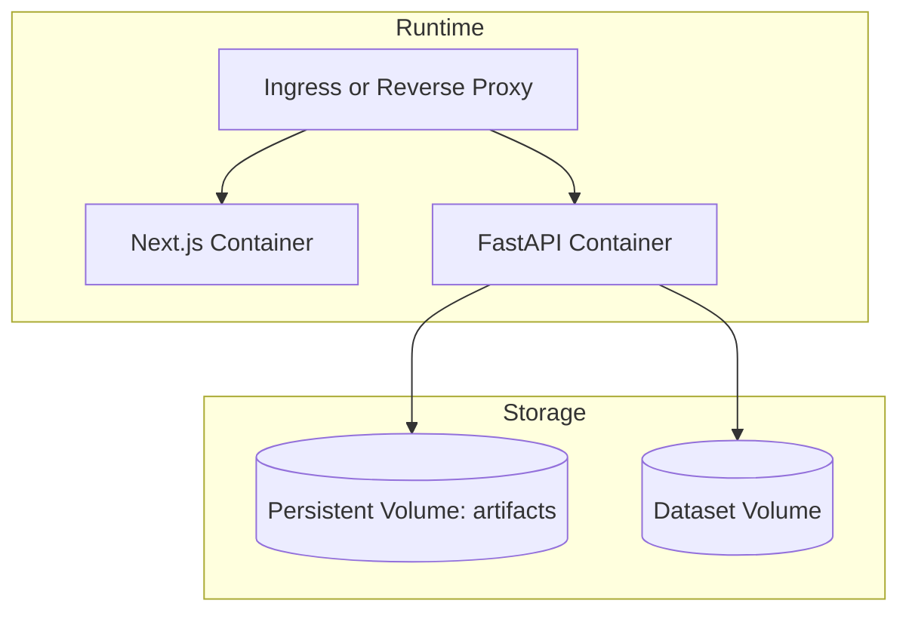

### Local Container Stack

- `docker/Dockerfile.api`
- `docker/Dockerfile.frontend`
- `docker-compose.yml`

## 18. CI/CD Model

This repository supports two complementary CI/CD planes:

- Pull request validation with GitHub Actions (`.github/workflows/ci.yml`)
- Release delivery with Jenkins + Argo CD + Argo Rollouts (`Jenkinsfile`, `infra/argocd`, `infra/k8s/overlays`)

Pipeline responsibilities:

- GitHub Actions:
  - Python dependency install, training pipeline execution, and `pytest`
  - frontend install, lint, and production build
- Jenkins:
  - repeat quality gates (train/test/lint/build)
  - container build/push to cloud registry
  - overlay image updates for selected rollout strategy
  - terraform plan/apply orchestration per cloud provider
  - Argo CD sync and optional blue/green promotion gate

This split keeps PR quality checks fast while preserving production-grade release controls.

<p align="center">
  
</p>

## 19. Capacity And Scalability Notes

### Current Runtime Profile

- batch training on local CSV.
- in-memory inference with preloaded artifacts.
- stateless API process except filesystem artifact reads.

### Horizontal Scaling

- API can scale horizontally if artifact directory is shared or baked into immutable image.
- frontend is static-app friendly and cacheable.

### Vertical Scaling

- train-time forest size and clustering config tunable via env vars.
- CPU-bound inference can be optimized with model simplification or serving workers.

## 20. Decisions And Tradeoffs

- RandomForest chosen for robust nonlinear performance on mixed feature types and small/medium dataset size.
- separate target models for clarity and independent metric tracking.
- filesystem-based registry chosen for simplicity and portability in local/portfolio contexts.
- dual API frameworks included to demonstrate framework portability and service abstraction.

## 21. Suggested Enterprise Evolution Path

- replace local registry files with managed model registry.
- add feature store for offline/online parity.
- add canary release process for promoted models.
- add data drift checks and scheduled retraining pipelines.
- add SLO dashboards and alerting tied to `/metrics` and model KPI regressions.

## 22. Source File Index

Core files:

- `src/youtube_success_ml/train.py`
- `src/youtube_success_ml/data/loader.py`
- `src/youtube_success_ml/models/supervised.py`
- `src/youtube_success_ml/models/clustering.py`
- `src/youtube_success_ml/api/fastapi_app.py`
- `src/youtube_success_ml/api/flask_app.py`
- `src/youtube_success_ml/mlops/quality.py`
- `src/youtube_success_ml/mlops/registry.py`
- `frontend/app/page.tsx`
- `frontend/app/visualizations/charts/page.tsx`
- `frontend/app/intelligence/lab/page.tsx`
- `frontend/app/wiki/page.tsx`
- `frontend/public/wiki/index.html`
- `.devcontainer/devcontainer.json`
- `.devcontainer/post-create.sh`
- `scripts/format_all.sh`
- `scripts/format_prettier.sh`
- `scripts/format_python.sh`

## 23. Operational Checklist

Before release:

- run training successfully
- verify `/ready` is healthy
- run full pytest suite
- run frontend lint and build
- confirm manifest and registry updated
- confirm smoke test passes against deployed API


## 24. Extended Interaction Charts

### API Capability Topology

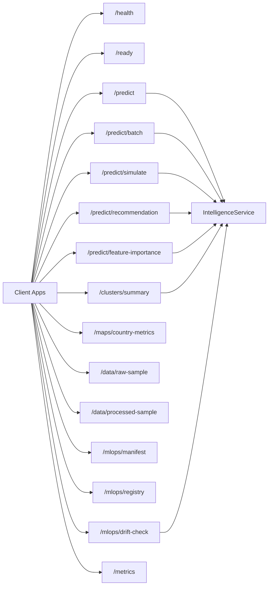

### Internal Service Collaboration

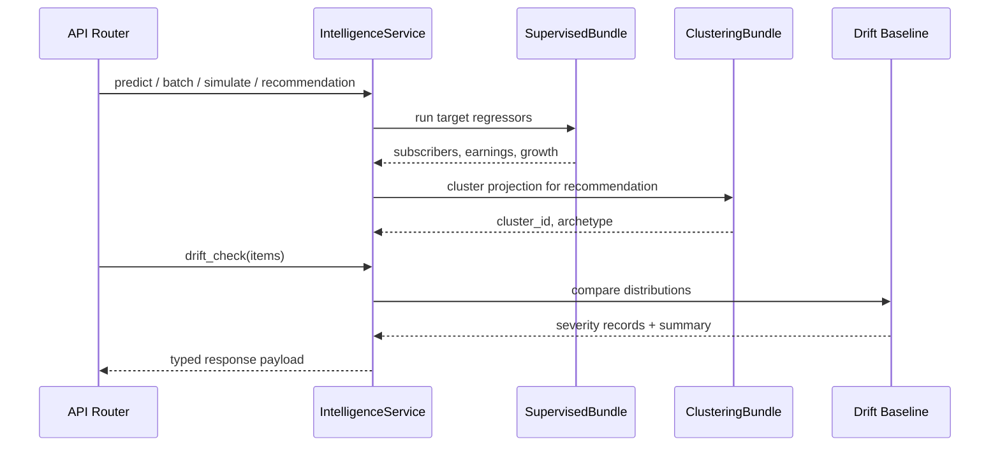

### Failure Handling Matrix

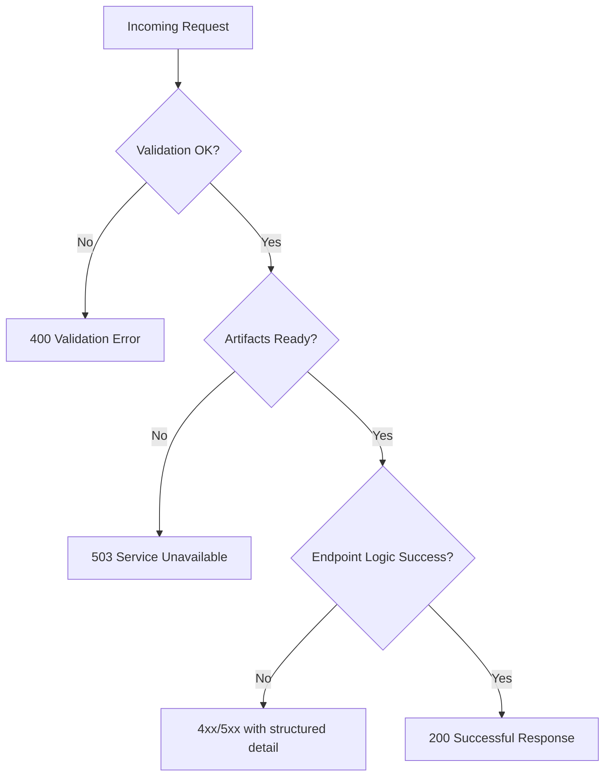

## 25. Data Contracts By Layer

### Inference Input Contract

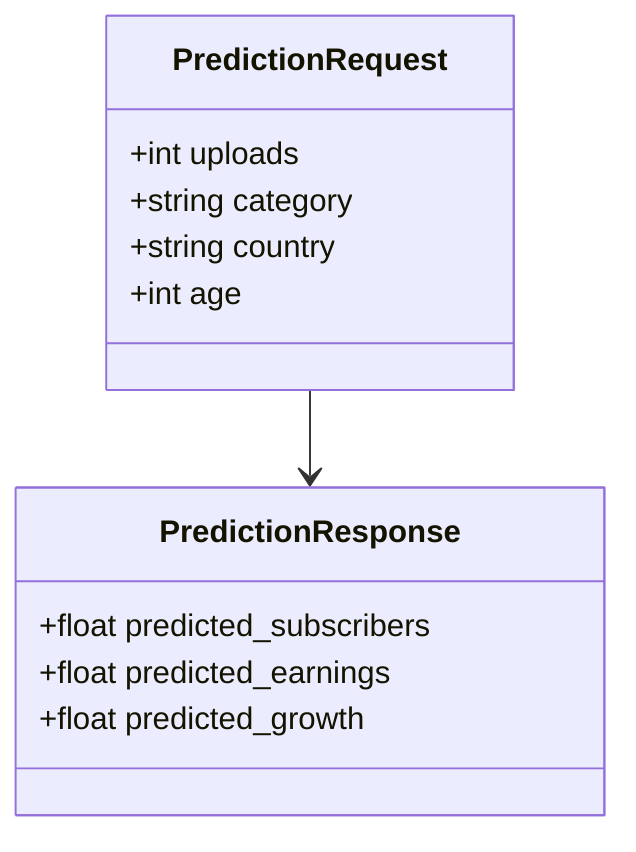

### Artifact Contract

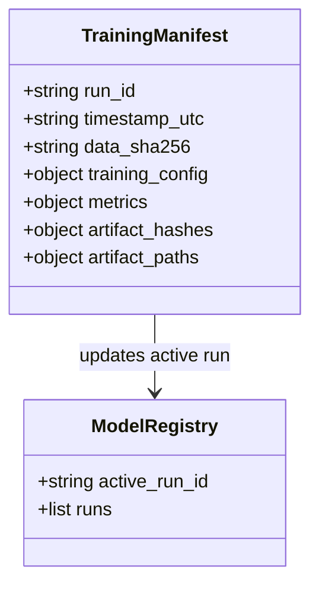

## 26. Deployment Variants

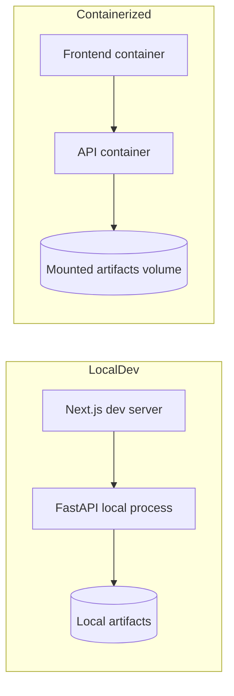

## 27. Incident Response Flow

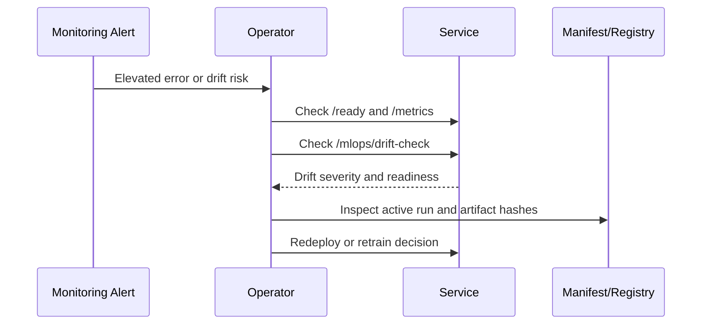

## 28. Trust Boundaries And Data Zones

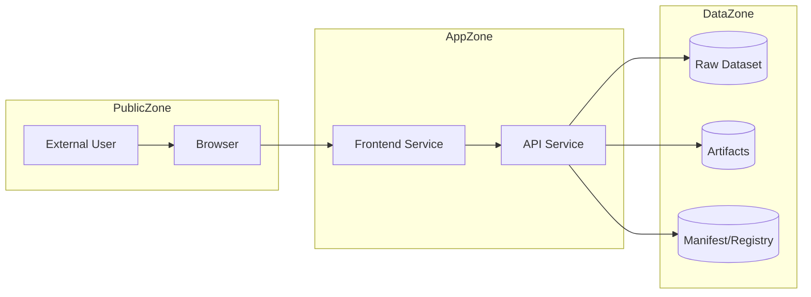

Boundary assumptions:

- Public zone is untrusted.
- App zone enforces schema validation and readiness checks.
- Data zone contains persistent assets and should be restricted to service principals.

## 29. Model Promotion And Rollback Design

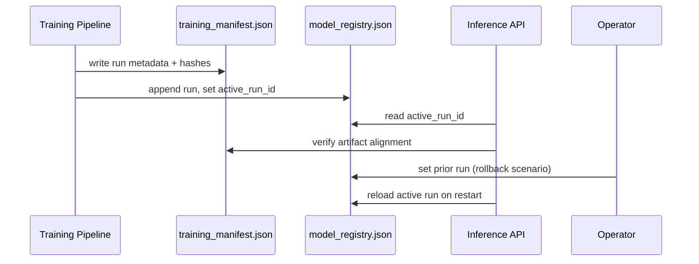

## 30. Request Routing By Capability

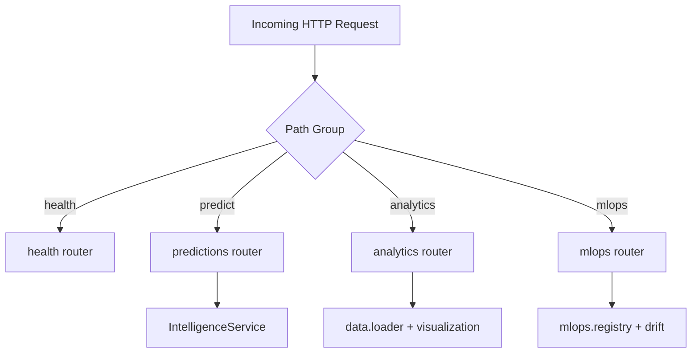

This routing split is the primary structural refactor that makes the API easier to scale and maintain.

## 31. Multi-Cloud Platform Topology

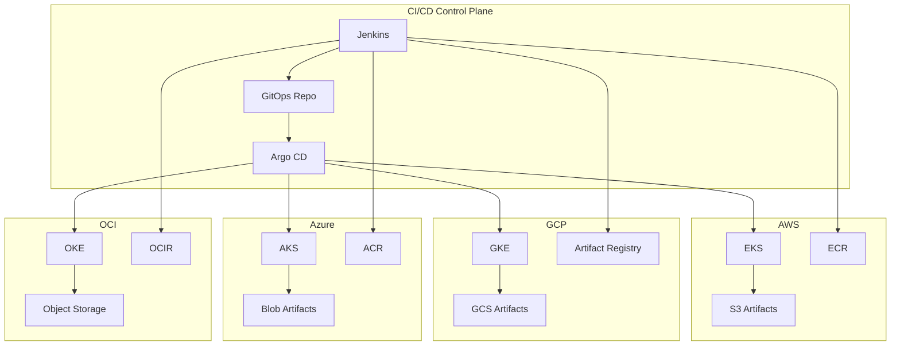

## 32. Strategy Control Plane

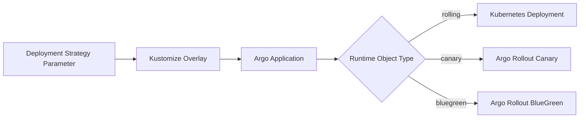

Key design:

- One runtime namespace (`yts-prod`) and one baseline service contract.
- Strategy decides controller behavior, not app code.
- Frontend and API move together under the same release tag.

## 33. Terraform Composition Model

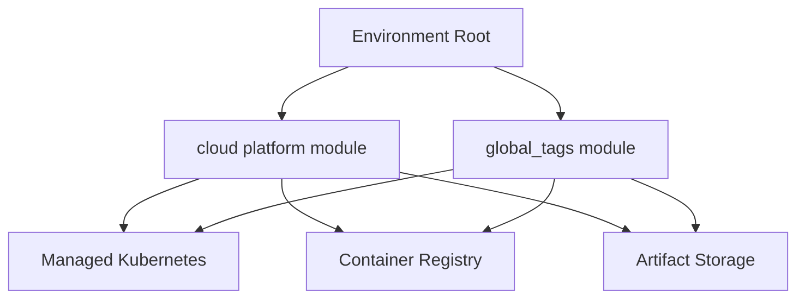

Root modules:

- `infra/terraform/environments/aws`
- `infra/terraform/environments/gcp`
- `infra/terraform/environments/azure`
- `infra/terraform/environments/oci`

Reusable modules:

- `infra/terraform/modules/global_tags`
- `infra/terraform/modules/aws_platform`
- `infra/terraform/modules/gcp_platform`
- `infra/terraform/modules/azure_platform`
- `infra/terraform/modules/oci_platform`

## 34. Release Promotion Sequence

```mermaid
sequenceDiagram
    participant Dev as Developer
    participant CI as Jenkins
    participant Reg as Cloud Registry
    participant GitOps as Overlay Repo
    participant Argo as Argo CD
    participant K8s as Cluster

    Dev->>CI: push commit
    CI->>CI: train + test + frontend build
    CI->>Reg: push yts-api + yts-frontend image tags
    CI->>GitOps: update overlay image references
    CI->>Argo: sync strategy app
    Argo->>K8s: apply manifests
    K8s-->>Argo: health + rollout status
```

## 35. Rollback And Recovery Path

```mermaid
flowchart TD
    Alert[Alert: SLO or health regression] --> Decision{Deployment Strategy?}
    Decision -- rolling --> RollBackDeploy[kubectl rollout undo deployment]
    Decision -- canary --> AbortCanary[kubectl argo rollouts abort]
    Decision -- bluegreen --> PromoteStable[keep active service on stable ReplicaSet]

    RollBackDeploy --> Verify[Verify /health and /ready]
    AbortCanary --> Verify
    PromoteStable --> Verify
```

Recovery invariants:

- health endpoints remain strategy-agnostic.
- rollback does not require data schema changes.
- model artifacts remain backward-compatible via manifest/registry lineage.

## 36. Non-Functional Requirements Matrix

| Dimension | Current implementation | Target/SLO guidance | Primary verification |
| --- | --- | --- | --- |
| Availability | Health and readiness endpoints with deployment rollback paths | `>= 99.5%` monthly API availability for single-region production | `/health`, `/ready`, rollout status checks |
| Reliability | Artifact readiness gating and versioned registry | Zero silent startup with missing artifacts | Readiness gate and startup smoke tests |
| Performance | FastAPI async serving and lightweight feature preprocessing | P95 prediction latency < 300ms under normal load | k6/Locust load testing, Prometheus histograms |
| Scalability | Kubernetes HPA, canary/bluegreen overlays | Horizontal scaling based on CPU and request volume | HPA metrics, cluster autoscaler events |
| Security | Network policies, secret templates, no embedded cloud creds | Least privilege across runtime and CI identities | IaC review, container scan, secret policy checks |
| Observability | Prometheus endpoint and drift-check diagnostics | End-to-end golden signals + model-risk signal visibility | `/metrics`, drift reports, alerting dashboards |
| Maintainability | Layered modules with domain-separated docs | Low change friction with synchronized docs and tests | PR checklist and CI quality gates |

## 37. Architecture Governance

Architecture changes follow an ADR-style workflow, even when ADR files are lightweight and embedded in pull request context.

Governance rules:

- Any new API domain or endpoint family requires updates to `API_REFERENCE.md` and Section 11 of this document.
- Any model feature/target/schema change requires updates to data contracts (Section 25), `README.md`, and `MLOPS.md`.
- Any runtime topology change (Kubernetes, Argo, Terraform) requires updates to Section 17/18/31+ and relevant `infra/*` docs.
- Breaking behavior changes must include migration notes in `README.md` and deployment rollback notes in `DEPLOYMENT.md`.

```mermaid
flowchart TD
    Proposal[Architecture Change Proposal] --> Impact[Impact Analysis]
    Impact --> ADR[ADR or PR Design Note]
    ADR --> Impl[Implementation]
    Impl --> Validation[Tests + Runtime Validation]
    Validation --> Docs[Documentation Synchronization]
    Docs --> Review[Architecture Review]
    Review --> Release[Release Approval]
```
