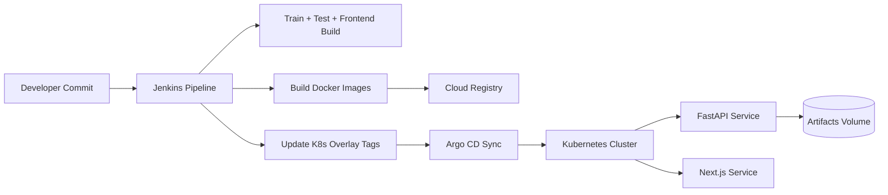
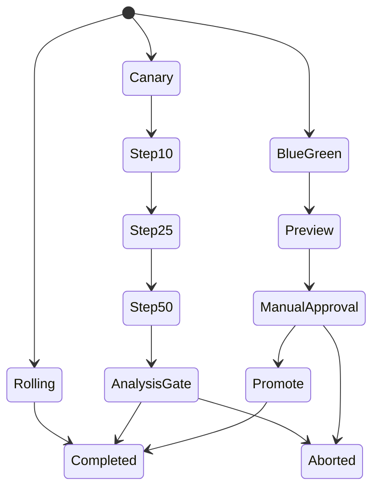
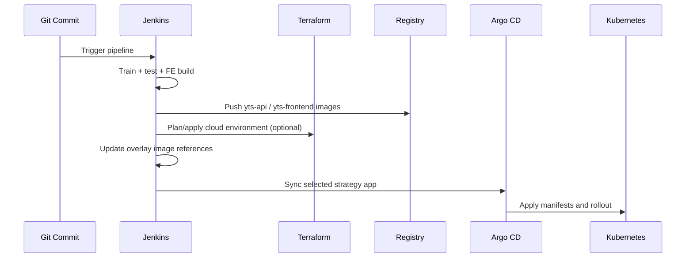
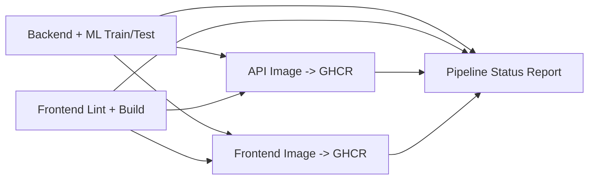
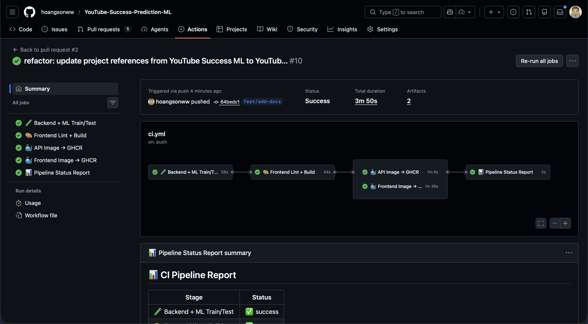
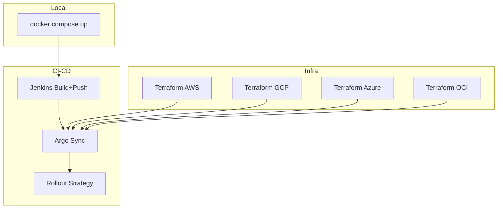

# Deployment Guide - YouTube Success Prediction ML Platform

This project ships a full multi-cloud deployment stack with:

- Kubernetes base runtime manifests.
- Argo CD GitOps applications.
- Argo Rollouts strategies (`rolling`, `canary`, `bluegreen`).
- GitHub Actions CI/CD pipeline for train/test/build/report + GHCR publishing.
- Jenkins CI/CD pipeline with image build/push + infra orchestration.
- Terraform cloud packs for AWS, GCP, Azure, and OCI.

## Table Of Contents

- [Document Metadata](#document-metadata)
- [Documentation Map](#documentation-map)
- [1) Deployment Architecture](#1-deployment-architecture)
- [2) Directory Map](#2-directory-map)
- [3) Kubernetes Runtime](#3-kubernetes-runtime)
- [4) Rollout Strategies](#4-rollout-strategies)
- [5) Argo CD GitOps](#5-argo-cd-gitops)
- [6) Jenkins Pipeline](#6-jenkins-pipeline)
- [7) GitHub Actions CI/CD](#7-github-actions-cicd)
- [8) Multi-Cloud Terraform Packs](#8-multi-cloud-terraform-packs)
- [9) Docker Integration](#9-docker-integration)
- [10) Required Cluster Add-ons](#10-required-cluster-add-ons)
- [11) Production Readiness Checklist](#11-production-readiness-checklist)
- [12) Deployment Modes Summary](#12-deployment-modes-summary)
- [13) Frontend Deployment](#13-frontend-deployment)

## Document Metadata

| Field | Value |
| --- | --- |
| Document role | Deployment and release operations runbook |
| Primary audience | Platform engineers, DevOps engineers, release managers |
| Last updated | February 18, 2026 |
| Delivery stack | GitHub Actions + Jenkins + Argo CD + Argo Rollouts + Kubernetes + Terraform |
| Runtime scope | Local Docker and multi-cloud Kubernetes production |

## Documentation Map

| Document | Scope | Use it when |
| --- | --- | --- |
| [`README.md`](README.md) | Bootstrap and local operations | You need day-1 setup and quality gate commands |
| [`ARCHITECTURE.md`](ARCHITECTURE.md) | Runtime topology rationale | You need design context for deployment choices |
| [`API_REFERENCE.md`](API_REFERENCE.md) | Health/readiness behavior | You need endpoint checks during rollout validation |
| [`MLOPS.md`](MLOPS.md) | Model release governance | You need lineage and drift considerations for promotion |
| [`FRONTEND.md`](FRONTEND.md) | Frontend runtime contract | You need client-side deployment/runtime details |
| [`infra/README.md`](infra/README.md) | Infrastructure index | You need infra entrypoints and quick commands |
| [`infra/k8s/README.md`](infra/k8s/README.md) | K8s manifest model | You are changing workloads, policies, overlays |
| [`infra/argocd/README.md`](infra/argocd/README.md) | GitOps strategy control | You are switching rollout strategy apps |
| [`infra/terraform/README.md`](infra/terraform/README.md) | Cloud IaC packs | You are provisioning/updating cloud foundations |

## 1) Deployment Architecture



## 2) Directory Map

```text
infra/
|-- k8s/
|   |-- base/                 # Production baseline manifests (rolling deployments)
|   `-- overlays/
|       |-- rolling/
|       |-- canary/           # Argo Rollout canary strategy
|       `-- bluegreen/        # Argo Rollout blue/green strategy
|-- argocd/
|   |-- projects/
|   |-- apps/default/
|   |-- apps/strategies/
|   |-- bootstrap.sh
|   `-- switch-strategy.sh
`-- terraform/
    |-- modules/              # Reusable provider modules
    `-- environments/         # Cloud roots (aws/gcp/azure/oci)
```

## 3) Kubernetes Runtime

### Base Runtime (`infra/k8s/base`)

Includes:

- `Deployment` for `yts-api` and `yts-frontend`.
- `Service`, `Ingress`, `HPA`, `PDB`, `NetworkPolicy`.
- `ConfigMap` + `Secret` template.
- Persistent volume claim for model artifacts.

Ingress model:

- `https://youtube-success.example.com` -> frontend service.
- `https://api.youtube-success.example.com` -> FastAPI service.

### Strategy Overlays (`infra/k8s/overlays`)

- `rolling`: native Kubernetes rolling updates.
- `canary`: Argo Rollout objects with weighted canary steps + API health analysis.
- `bluegreen`: Argo Rollout objects with preview service and manual promotion gate.

Render manifests:

```bash
kubectl kustomize infra/k8s/overlays/rolling
kubectl kustomize infra/k8s/overlays/canary
kubectl kustomize infra/k8s/overlays/bluegreen
```

## 4) Rollout Strategies



### Blue/Green Promotion

```bash
kubectl argo rollouts promote yts-api -n yts-prod
kubectl argo rollouts promote yts-frontend -n yts-prod
```

### Rollback

```bash
kubectl argo rollouts undo yts-api -n yts-prod
kubectl argo rollouts undo yts-frontend -n yts-prod
```

## 5) Argo CD GitOps

### Bootstrap

```bash
bash infra/argocd/bootstrap.sh
```

This applies:

- `AppProject`: `infra/argocd/projects/yts-project.yaml`
- default rolling app: `infra/argocd/apps/default/yts-rolling.yaml`

### Switch Strategy App

```bash
bash infra/argocd/switch-strategy.sh rolling
bash infra/argocd/switch-strategy.sh canary
bash infra/argocd/switch-strategy.sh bluegreen
```

## 6) Jenkins Pipeline

Pipeline file: `Jenkinsfile`

Stages:

1. `Checkout`
2. `ML + API Quality Gates` (`make train`, `make test`)
3. `Frontend Quality Gates` (`npm ci`, `npm run lint`, `npm run build`)
4. `Registry Login` (cloud-specific)
5. `Build and Push Images`
6. `Update K8s Overlay Tags`
7. `Terraform Plan / Apply`
8. `Argo Sync`
9. `Blue/Green Promotion Gate` (manual input)



Helper scripts:

- `scripts/ci/registry_login.sh`
- `scripts/ci/build_and_push.sh`
- `scripts/ci/update_kustomize_images.sh`
- `scripts/ci/terraform_plan_apply.sh`
- `scripts/ci/argo_sync.sh`
- `scripts/ci/rollout_promote.sh`

### Jenkins Credentials / Environment Inputs

Common:

- `CLOUD_PROVIDER` (`aws|gcp|azure|oci`)
- `DEPLOY_STRATEGY` (`rolling|canary|bluegreen`)
- `IMAGE_TAG` (optional override; defaults to git SHA)
- `GITOPS_BRANCH` (branch receiving updated overlay image tags)
- Git credential with push access to the deployment repository

AWS:

- `AWS_REGION`
- `AWS_ACCOUNT_ID`
- AWS credentials with ECR/EKS/Terraform permissions

GCP:

- `GCP_PROJECT_ID`
- `GCP_REGION`
- `GCP_ARTIFACT_REPO`
- service account credentials for Artifact Registry/GKE/Terraform

Azure:

- `AZURE_ACR_NAME`
- service principal credentials for ACR/AKS/Terraform

OCI:

- `OCI_REGION`
- `OCI_TENANCY_NAMESPACE`
- `OCI_USERNAME`
- `OCI_AUTH_TOKEN`
- OCI API credentials for OKE/Object Storage/Terraform

## 7) GitHub Actions CI/CD

Workflow file: `.github/workflows/ci.yml`

Purpose:

- enforce backend ML quality gates and frontend quality gates
- publish Docker images to GHCR from the same Dockerfiles used by production
- provide workflow and PR-level pipeline status reporting

Job topology:

1. `🧪 Backend + ML Train/Test`
- installs Python dependencies
- runs training (`python -m youtube_success_ml.train --run-all`)
- runs tests (`pytest -q`)
- uploads ML artifacts
- sets:
  - `YTS_PROJECT_ROOT=${{ github.workspace }}`
  - `YTS_DATA_PATH=${{ github.workspace }}/data/Global YouTube Statistics.csv`
  - dataset source reference: [Kaggle - Global YouTube Statistics 2023](https://www.kaggle.com/datasets/nelgiriyewithana/global-youtube-statistics-2023?resource=download)
  - `YTS_ARTIFACT_DIR=${{ github.workspace }}/artifacts`

2. `🎨 Frontend Lint + Build`
- runs `npm ci`, `npm run lint`, `npm run build`
- uploads frontend build artifacts

3. `🐳 API Image -> GHCR` and `🐳 Frontend Image -> GHCR`
- both depend on backend and frontend stages
- both execute in parallel once quality gates pass
- both log in with `docker/login-action` and `GITHUB_TOKEN`
- both publish `sha` and `latest` tags to GHCR
- publish is skipped for pull requests (runs on `push`/`workflow_dispatch`)

4. `📊 Pipeline Status Report`
- writes GitHub job summary
- comments PR status (update-in-place)
- enforces final workflow success



<p align="center">
  
</p>

## 8) Multi-Cloud Terraform Packs

Each cloud has a root environment in `infra/terraform/environments/<cloud>` and a provider module in `infra/terraform/modules/<provider>_platform`.

### AWS

- EKS cluster + node group
- ECR repos (`yts-api`, `yts-frontend`)
- S3 artifacts bucket

```bash
cd infra/terraform/environments/aws
cp terraform.tfvars.example terraform.tfvars
terraform init
terraform plan
```

### GCP

- GKE cluster + node pool
- Artifact Registry repo
- GCS artifacts bucket

```bash
cd infra/terraform/environments/gcp
cp terraform.tfvars.example terraform.tfvars
terraform init
terraform plan
```

### Azure

- AKS cluster
- ACR registry
- Blob storage account/container

```bash
cd infra/terraform/environments/azure
cp terraform.tfvars.example terraform.tfvars
terraform init
terraform plan
```

### OCI

- OKE cluster + node pool
- OCIR repositories
- Object storage bucket

```bash
cd infra/terraform/environments/oci
cp terraform.tfvars.example terraform.tfvars
terraform init
terraform plan
```

## 9) Docker Integration

Existing Docker setup remains first-class and is the source for production images:

- API: `docker/Dockerfile.api`
- Frontend: `docker/Dockerfile.frontend`
- Local full stack: `docker-compose.yml`

Jenkins and GitHub Actions both use the same Dockerfiles for image publishing.

## 10) Required Cluster Add-ons

Install before canary/bluegreen production rollout:

- Ingress controller (`ingress-nginx` or equivalent).
- Argo CD.
- Argo Rollouts controller + kubectl plugin.
- Metrics server (for HPA).

## 11) Production Readiness Checklist

1. Terraform state backend configured (no placeholder values).
2. Registry auth and push permissions validated.
3. Argo CD has repo access and project applied.
4. `kubectl kustomize infra/k8s/overlays/<strategy>` renders cleanly.
5. `make train && make test` passing in CI.
6. `/health` and `/ready` probes succeed post-deploy.
7. Blue/green manual promotion runbook validated.
8. Rollback command tested in staging.

## 12) Deployment Modes Summary

The platform supports multiple deployment modes to fit different operational needs:



For local development and testing, `docker compose` provides a quick way to run the full stack. For production deployments, the Jenkins pipeline orchestrates image building, cloud provisioning (optional), and Argo CD synchronization with the selected rollout strategy. The Terraform packs allow for flexible multi-cloud infrastructure management aligned with the deployment process.

## 13) Frontend Deployment

We recommend deploying frontend on Vercel due to convenience and ease of deployment. 

FYI, a demo frontend is available on Vercel at: [https://youtube-success.vercel.app](https://youtube-success.vercel.app). However, backend functionalities are not connected. Please run the backend API and AI/ML functionalities to enjoy all features of the platform.

To deploy on Vercel, simply connect your fork of the repository to Vercel, select the frontend directory as the project root, and use the Next.js preset. Set the environment variable `NEXT_PUBLIC_API_BASE_URL` to point to your deployed API host for full functionality.
