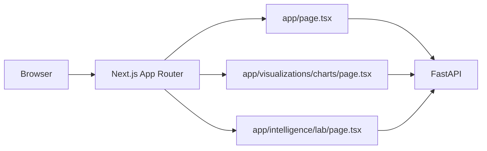

# Frontend Guide - YouTube Success Prediction ML Platform

This frontend is an app-router Next.js app (in `frontend/`) that consumes FastAPI endpoints and renders interactive intelligence views.

> [!TIP]
> A demo frontend is also available at [https://youtube-success.vercel.app](https://youtube-success.vercel.app). Only the UI demo is available. For it to be fully functional, please set up the backend API and ML serving locally.

## Table Of Contents

- [User Interface Overview](#user-interface-overview)
- [Document Metadata](#document-metadata)
- [Documentation Map](#documentation-map)
- [Routes](#routes)
- [Architecture](#architecture)
- [SEO + Metadata](#seo--metadata)
- [Charts Stack](#charts-stack)
- [API Contract](#api-contract)
- [Build And Validate](#build-and-validate)
- [Deployment](#deployment)

## User Interface Overview

The UI is designed to provide a comprehensive dashboard for YouTube success prediction, featuring:

<p align="center">
  
</p>

<p align="center">
  
</p>

<p align="center">
  
</p>

<p align="center">
  
</p>

<p align="center">
  
</p>

<p align="center">
  
</p>

## Document Metadata

| Field | Value |
| --- | --- |
| Document role | Frontend architecture and integration guide |
| Primary audience | Frontend engineers, product engineers, UI platform contributors |
| Last updated | February 18, 2026 |
| Frontend stack | Next.js 14 + TypeScript + Recharts |
| API dependency | `NEXT_PUBLIC_API_BASE_URL` |

## Documentation Map

| Document | Scope | Use it when |
| --- | --- | --- |
| [`README.md`](README.md) | Frontend bootstrapping commands | You need local setup and base runtime instructions |
| [`API_REFERENCE.md`](API_REFERENCE.md) | Endpoint request/response contracts | You need payload shapes for client data fetching |
| [`ARCHITECTURE.md`](ARCHITECTURE.md) | System interaction context | You need route-to-service boundaries |
| [`DEPLOYMENT.md`](DEPLOYMENT.md) | Build/release process | You need production deployment requirements |

## Routes

- `/`: prediction and platform dashboard.
- `/visualizations/charts`: analytics and post-processing charts.
- `/intelligence/lab`: simulation, explainability, and strategy analysis.
- `/wiki`: embedded project wiki page.
- `/wiki/index.html`: standalone static wiki asset.

## Architecture



## SEO + Metadata

Global metadata is configured in:

- `frontend/app/layout.tsx`
- `frontend/app/robots.ts`
- `frontend/app/sitemap.ts`
- `frontend/app/manifest.ts`

Favicon and icon assets are loaded from `frontend/public/`.

## Charts Stack

- `recharts` for interactive, responsive charting.
- Data transforms performed in page clients before visualization.
- Charts include category performance, upload-growth analysis, cluster compositions, and country-level comparisons.

## API Contract

`NEXT_PUBLIC_API_BASE_URL` must point at the deployed API host.

Example:

```bash
NEXT_PUBLIC_API_BASE_URL=https://api.youtube-success.example.com
```

## Build And Validate

Run the below one-liner to quickly install all dependencies, lint, and build the frontend in one go:

```bash
cd frontend
npm ci
npm run lint
npm run build
```

## Deployment

We recommend using Vercel for frontend deployment, as it is the most compatible option with Next and TypeScript. Simply connect your fork of this project to Vercel and use the Vercel dashboard on the web to easily deploy the frontend (remember to select the code directory to be /frontend and use the Next.je preset). 

> [!TIP]
> A demo frontend is also available at [https://youtube-success.vercel.app](https://youtube-success.vercel.app). Only the UI demo is available. For it to be fully functional, please set up the backend API and ML serving locally.

