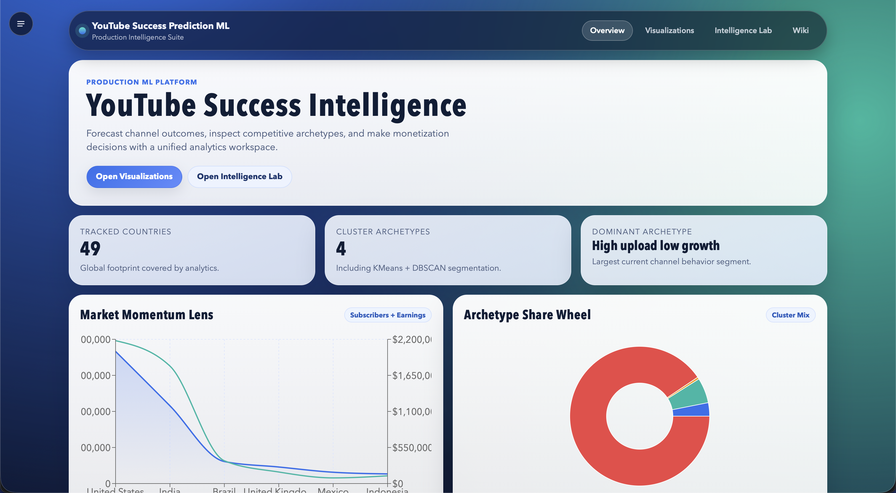
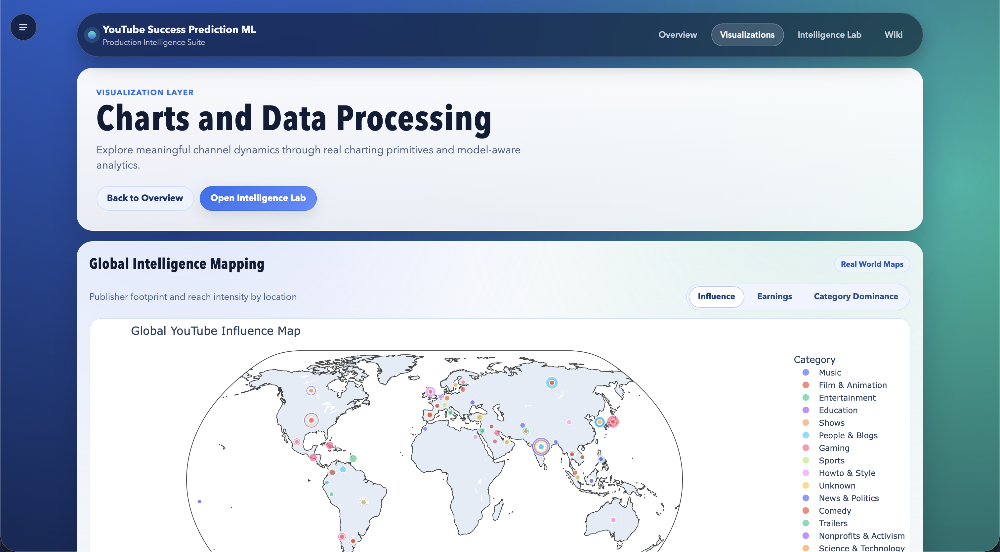
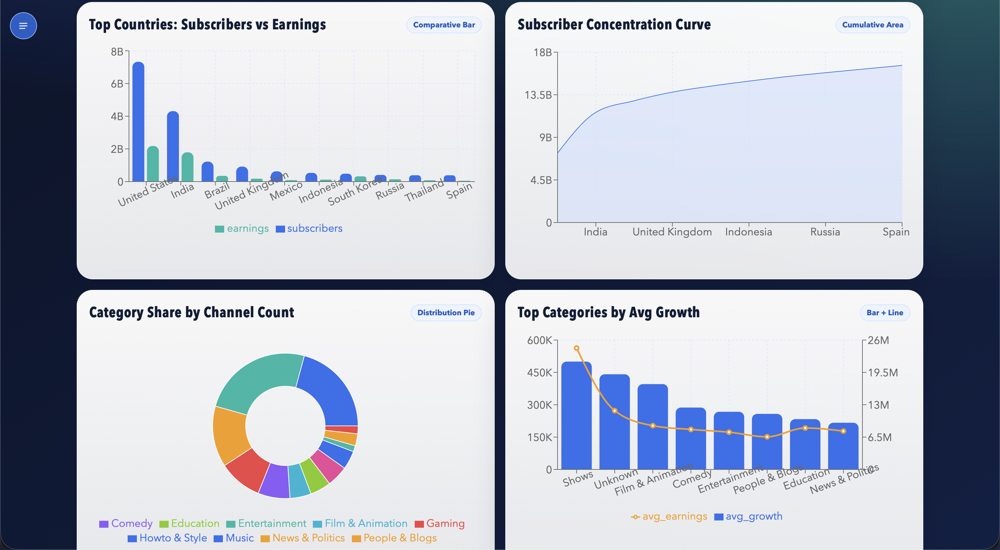
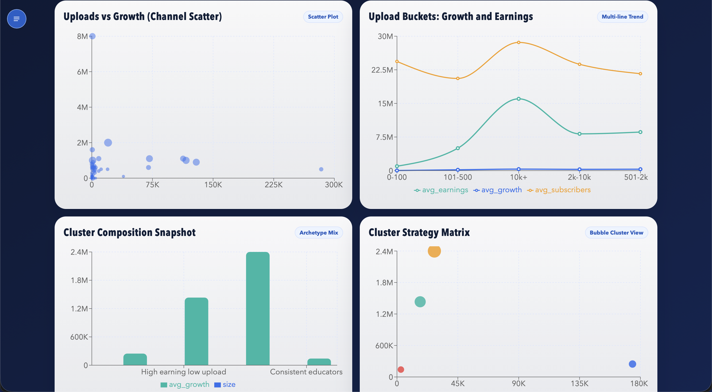
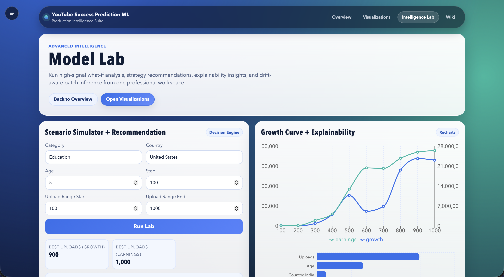
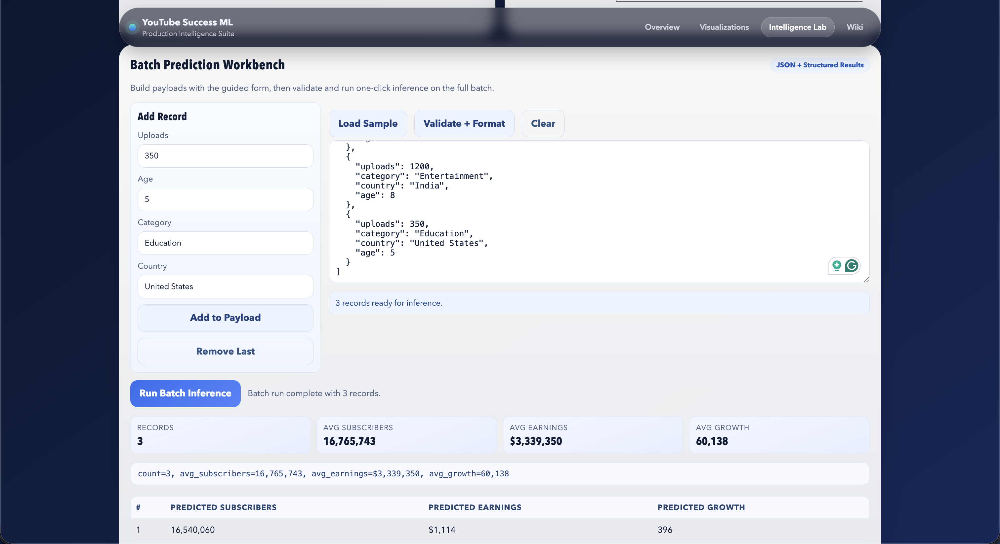
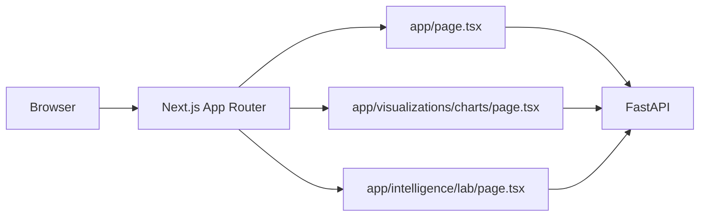
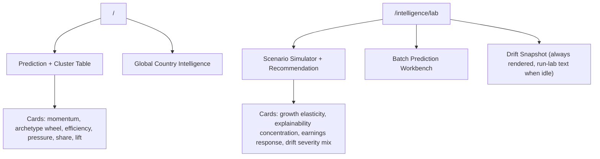
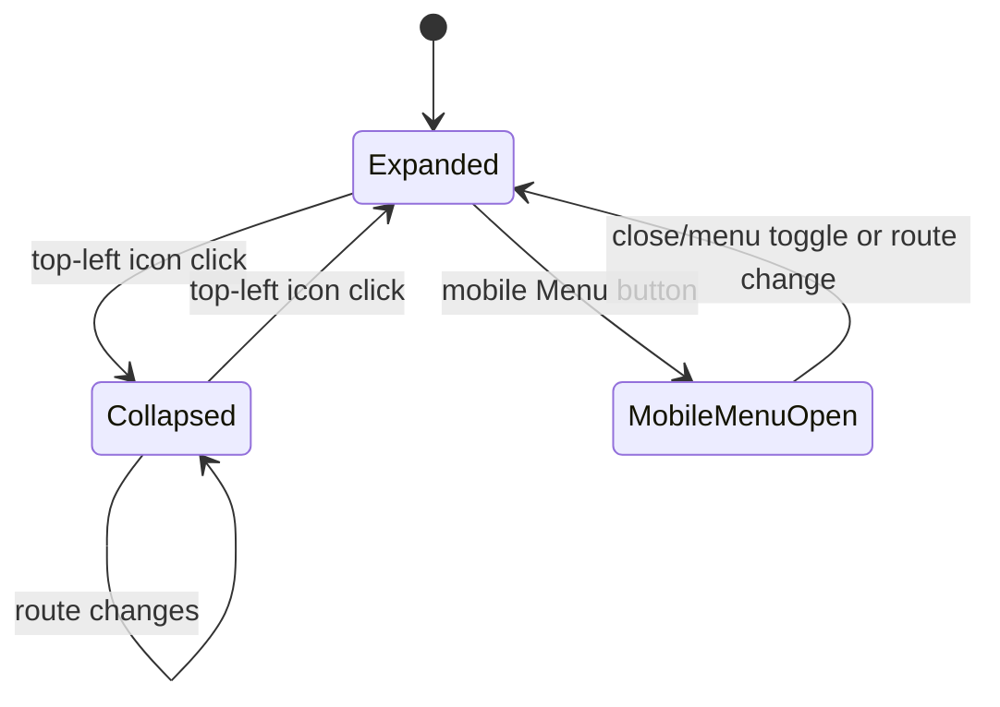

# Frontend Guide - YouTube Success Prediction ML Platform

This frontend is an app-router Next.js app (in `frontend/`) that consumes FastAPI endpoints and renders interactive intelligence views.

> [!TIP]
> A demo frontend is also available at [https://youtube-success.vercel.app](https://youtube-success.vercel.app). Only the UI demo is available. For it to be fully functional, please set up the backend API and ML serving locally.

## Table Of Contents

- [User Interface Overview](#user-interface-overview)
- [Document Metadata](#document-metadata)
- [Documentation Map](#documentation-map)
- [Routes](#routes)
- [Architecture](#architecture)
- [Visual Composition Map](#visual-composition-map)
- [Navigation Interaction Map](#navigation-interaction-map)
- [SEO + Metadata](#seo--metadata)
- [Charts Stack](#charts-stack)
- [API Contract](#api-contract)
- [Build And Validate](#build-and-validate)
- [Deployment](#deployment)

## User Interface Overview

The UI is designed to provide a comprehensive dashboard for YouTube success prediction, featuring:

<p align="center">
  
</p>

<p align="center">
  
</p>

<p align="center">
  
</p>

<p align="center">
  
</p>

<p align="center">
  
</p>

<p align="center">
  
</p>

## Document Metadata

| Field | Value |
| --- | --- |
| Document role | Frontend architecture and integration guide |
| Primary audience | Frontend engineers, product engineers, UI platform contributors |
| Last updated | March 8, 2026 |
| Frontend stack | Next.js 14 + TypeScript + Recharts |
| API dependency | `NEXT_PUBLIC_API_BASE_URL` |

## Documentation Map

| Document | Scope | Use it when |
| --- | --- | --- |
| [`README.md`](README.md) | Frontend bootstrapping commands | You need local setup and base runtime instructions |
| [`API_REFERENCE.md`](API_REFERENCE.md) | Endpoint request/response contracts | You need payload shapes for client data fetching |
| [`ARCHITECTURE.md`](ARCHITECTURE.md) | System interaction context | You need route-to-service boundaries |
| [`DEPLOYMENT.md`](DEPLOYMENT.md) | Build/release process | You need production deployment requirements |

## Routes

- `/`: prediction and platform dashboard with six visual cards above country intelligence (momentum, archetype wheel, revenue efficiency, category pressure, market share balance, monetization lift).
- `/visualizations/charts`: real map workspace + analytics and post-processing charts.
- `/intelligence/lab`: simulation, explainability, strategy analysis, and four insight cards above batch workbench (growth elasticity, explainability concentration, earnings response gradient, drift severity mix), with chart empty-state guidance before first run.
- `/wiki`: embedded project wiki page.
- `/wiki/index.html`: standalone static wiki asset.
- global shell: icon-only top-left control to collapse/expand sticky top navbar with animations.

## Architecture


```mermaid
flowchart LR
    Browser --> NextApp[Next.js App Router]
    NextApp --> PageHome[app/page.tsx]
    NextApp --> PageCharts[app/visualizations/charts/page.tsx]
    NextApp --> PageLab[app/intelligence/lab/page.tsx]

    PageHome --> API[FastAPI]
    PageCharts --> API
    PageLab --> API
```

## Visual Composition Map


```mermaid
flowchart TB
    HOME["/"] --> H1["Prediction + Cluster Table"]
    HOME --> H2["Global Country Intelligence"]
    H1 --> HC["Cards: momentum, archetype wheel, efficiency, pressure, share, lift"]

    LAB["/intelligence/lab"] --> L1["Scenario Simulator + Recommendation"]
    LAB --> L2["Batch Prediction Workbench"]
    L1 --> LC["Cards: growth elasticity, explainability concentration, earnings response, drift severity mix"]
    LAB --> DS["Drift Snapshot (always rendered, run-lab text when idle)"]
```

## Navigation Interaction Map


```mermaid
stateDiagram-v2
    [*] --> Expanded
    Expanded --> Collapsed: top-left icon click
    Collapsed --> Expanded: top-left icon click
    Expanded --> MobileMenuOpen: mobile Menu button
    MobileMenuOpen --> Expanded: close/menu toggle or route change
    Collapsed --> Collapsed: route changes
```

## SEO + Metadata

Global metadata is configured in:

- `frontend/app/layout.tsx`
- `frontend/app/robots.ts`
- `frontend/app/sitemap.ts`
- `frontend/app/manifest.ts`

Favicon and icon assets are loaded from `frontend/public/`.

## Charts Stack

- `recharts` for interactive, responsive charting.
- Data transforms performed in page clients before visualization.
- Visuals include:
  - overview cards: market momentum lens + archetype share wheel + revenue efficiency signals + category pressure map + market share balance + monetization lift curve
  - real map embeds from backend (`/maps/influence-map`, `/maps/earnings-choropleth`, `/maps/category-dominance`)
  - category performance and upload-growth analysis
  - cluster composition + cluster strategy matrix
  - model lab cards: growth elasticity pulse + explainability concentration + earnings response gradient + drift severity mix
  - growth/explainability chart cards show explicit "run the lab" empty-state text before first simulation
  - Drift Snapshot card is always visible and shows explicit run-lab guidance when idle (skeleton only during active lab execution)
  - icon-only top-left shell control animates navbar collapse/expand without affecting page routing
  - country-level comparisons and data contract tables

## API Contract

`NEXT_PUBLIC_API_BASE_URL` must point at the deployed API host.

Visualization-specific dependencies:

- `GET /maps/influence-map` (HTML embed)
- `GET /maps/earnings-choropleth` (HTML embed)
- `GET /maps/category-dominance` (HTML embed)
- `GET /maps/country-metrics` (country totals + geo fields for summary cards)
- `GET /clusters/summary` (cluster matrix + composition views)

Example:

```bash
NEXT_PUBLIC_API_BASE_URL=https://api.youtube-success.example.com
```

## Build And Validate

Run the below one-liner to quickly install all dependencies, lint, and build the frontend in one go:

```bash
cd frontend
npm ci
npm run lint
npm run build
```

## Deployment

We recommend using Vercel for frontend deployment, as it is the most compatible option with Next and TypeScript. Simply connect your fork of this project to Vercel and use the Vercel dashboard on the web to easily deploy the frontend (remember to select the code directory to be /frontend and use the Next.js preset).

> [!TIP]
> A demo frontend is also available at [https://youtube-success.vercel.app](https://youtube-success.vercel.app). Only the UI demo is available. For it to be fully functional, please set up the backend API and ML serving locally.
