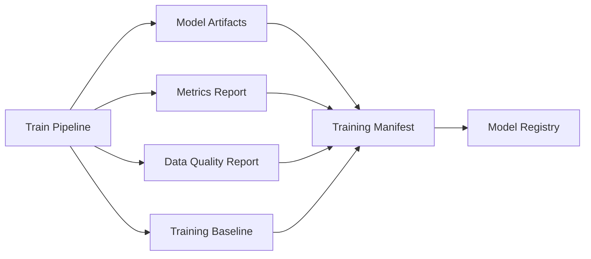
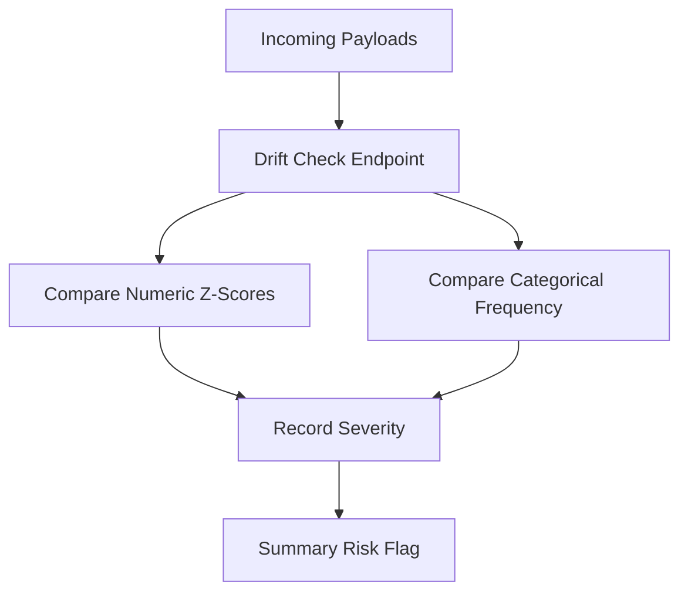
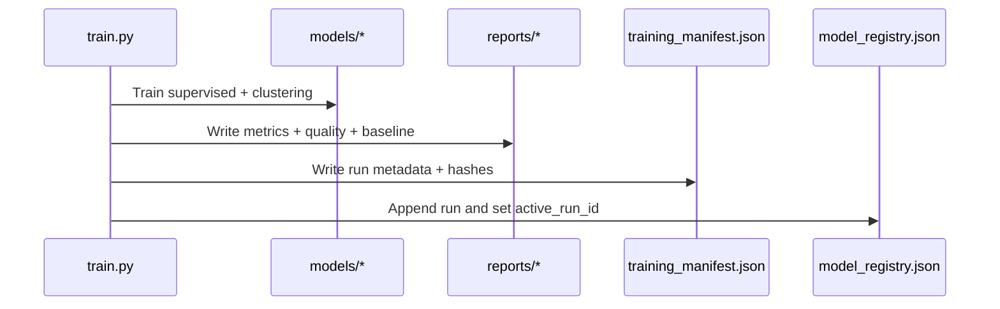
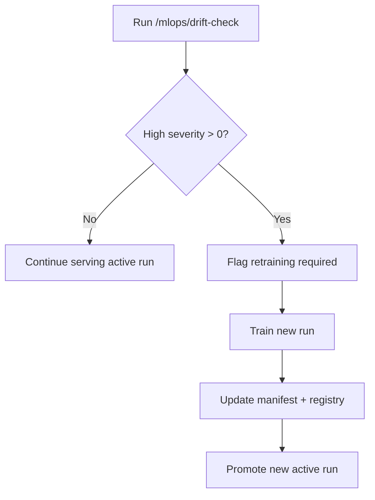

# MLOps Guide - YouTube Success Prediction ML Platform

Below is the MLOps guide for the YouTube Success Prediction ML Platform, detailing artifact management, manifest and registry design, drift operations, and governance best practices.

## Table Of Contents

- [Document Metadata](#document-metadata)
- [Documentation Map](#documentation-map)
- [Dataset Overview](#dataset-overview)
- [Artifact Lifecycle](#artifact-lifecycle)
- [Manifest + Registry](#manifest--registry)
- [MLOps Capability Matrix](#mlops-capability-matrix)
- [Enablement Profiles](#enablement-profiles)
- [Experiment Tracking](#experiment-tracking)
- [Hyperparameter Optimization](#hyperparameter-optimization)
- [Feature Store And Data Versioning](#feature-store-and-data-versioning)
- [Scheduled Retraining Orchestration](#scheduled-retraining-orchestration)
- [Monitoring Stack](#monitoring-stack)
- [MLOps Capability Endpoint](#mlops-capability-endpoint)
- [Drift Operations](#drift-operations)
- [Training And Registry Update Sequence](#training-and-registry-update-sequence)
- [Drift Response Policy](#drift-response-policy)
- [Readiness Gating](#readiness-gating)
- [Recommended Production Controls](#recommended-production-controls)
- [Governance Checklist](#governance-checklist)

## Document Metadata

| Field | Value |
| --- | --- |
| Document role | MLOps lifecycle, governance, and operational controls |
| Primary audience | ML engineers, MLOps engineers, reliability engineers |
| Last updated | February 18, 2026 |
| Artifact roots | `artifacts/models`, `artifacts/reports`, `artifacts/mlops` |
| Control owner | ML platform governance |

## Documentation Map

| Document | Scope | Use it when |
| --- | --- | --- |
| [`README.md`](README.md) | End-to-end runbook | You need train/test bootstrap operations |
| [`ARCHITECTURE.md`](ARCHITECTURE.md) | Component and data lifecycle context | You need system-level interaction details |
| [`API_REFERENCE.md`](API_REFERENCE.md) | MLOps endpoint contracts | You need drift/manifest/registry API behavior |
| [`DEPLOYMENT.md`](DEPLOYMENT.md) | Promotion and rollout controls | You need release orchestration policy alignment |

## Dataset Overview

MLOps lineage in this project is dataset-aware and records the exact dataset hash used by each training run.

Primary source dataset:

- default file: `data/Global YouTube Statistics.csv`
- canonical source: [Kaggle - Global YouTube Statistics 2023](https://www.kaggle.com/datasets/nelgiriyewithana/global-youtube-statistics-2023?resource=download)
- encoding: `latin-1`
- row count: `995`
- raw columns: `28`

Processed dataset artifact:

- file: `data/global_youtube_statistics_processed.csv`
- row count: `995`
- processed columns: `30`
- includes engineered fields: `age`, `growth_target`

Path resolution behavior (training/runtime):

- resolver: `resolve_data_path()` in `src/youtube_success_ml/data/loader.py`
- default env override: `YTS_DATA_PATH`
- project root override: `YTS_PROJECT_ROOT`
- CI stabilization variables:
  - `YTS_PROJECT_ROOT=${{ github.workspace }}`
  - `YTS_DATA_PATH=${{ github.workspace }}/data/Global YouTube Statistics.csv`
  - `YTS_ARTIFACT_DIR=${{ github.workspace }}/artifacts`

MLOps relevance:

- every manifest captures `data_path` and `data_sha256`
- registry changes (`active_run_id`) should always be interpreted together with dataset fingerprint
- retraining/promotion decisions should verify dataset continuity or explicitly document dataset drift

## Artifact Lifecycle



Generated files:

- `artifacts/models/supervised_bundle.joblib`
- `artifacts/models/clustering_bundle.joblib`
- `artifacts/models/clustered_channels.csv`
- `artifacts/reports/training_metrics.json`
- `artifacts/reports/data_quality_report.json`
- `artifacts/reports/training_baseline.json`
- `artifacts/reports/feature_store_snapshot.csv`
- `artifacts/mlops/training_manifest.json`
- `artifacts/mlops/model_registry.json`

## Manifest + Registry

### Manifest

Tracks immutable evidence for a run:

- run id
- dataset hash
- training config
- metrics snapshot
- artifact hashes and paths

### Registry

Tracks run history and active run pointer:

- `active_run_id`
- chronological run records

## MLOps Capability Matrix

| Capability | Status in repo | Primary files | Activation model |
| --- | --- | --- | --- |
| Artifact lineage + registry | Implemented | `mlops/registry.py`, `train.py` | Default |
| Data quality + drift baseline | Implemented | `mlops/quality.py`, `mlops/drift.py` | Default |
| Experiment tracking | Implemented | `mlops/experiments.py` | Opt-in env flags |
| Hyperparameter optimization | Implemented | `mlops/hpo.py` | Opt-in CLI flags |
| Feature store scaffolding | Implemented | `feature_store/feast/*` | Opt-in setup |
| Data versioning pipeline | Implemented | `dvc.yaml`, `params.yaml` | Opt-in setup |
| Scheduled retraining flow | Implemented | `orchestration/prefect/retraining_flow.py` | Opt-in runtime |
| Monitoring stack | Implemented | `infra/monitoring/*`, `infra/k8s/monitoring/*` | Opt-in deployment |

## Enablement Profiles

### Profile 1: Default (CI-safe baseline)

- no MLflow/W&B/Optuna/Prefect required
- training and tests run with built-in stack only
- this is the profile used by GitHub Actions quality gates

### Profile 2: Extended MLOps

- install: `pip install --no-build-isolation -e ".[mlops]"`
- enable one or more:
  - experiment tracking
  - Optuna HPO
  - Prefect retraining orchestration
  - DVC/Feast workflows
  - Prometheus/Grafana observability

### Profile 3: Production control-plane

- run training + drift checks + capability endpoint checks
- deploy monitoring stack
- schedule retraining flows
- gate promotion on readiness + strategy rollout health

## Experiment Tracking

The training pipeline now supports optional experiment tracking backends:

- `MLflow` (`YTS_ENABLE_MLFLOW=true`)
- `Weights & Biases` (`YTS_ENABLE_WANDB=true`)

Implementation:

- tracker module: `src/youtube_success_ml/mlops/experiments.py`
- integration point: `src/youtube_success_ml/train.py`

Logged payloads when enabled:

- training parameters
- supervised metrics
- key artifacts:
  - `training_metrics.json`
  - `data_quality_report.json`
  - `training_baseline.json`
  - `feature_store_snapshot.csv`

Runtime flags:

- `YTS_ENABLE_MLFLOW=true`
- `YTS_ENABLE_WANDB=true`
- `YTS_EXPERIMENT_TRACKING_STRICT=true` to fail fast when backend package is missing

## Hyperparameter Optimization

Optuna integration is optional and activated via CLI:

```bash
PYTHONPATH=src python -m youtube_success_ml.train --run-all --optuna-trials 25
```

Implementation:

- HPO module: `src/youtube_success_ml/mlops/hpo.py`
- output artifact: `artifacts/reports/optuna_study.json`

The tuned parameters are fed back into supervised training for the same run.

Additional flags:

- `--optuna-timeout-seconds`
- `--optuna-storage`
- `--optuna-study-name`

## Feature Store And Data Versioning

Data versioning and feature store scaffolding is included in-repo:

- DVC pipeline:
  - `dvc.yaml`
  - `params.yaml`
- Feast feature repo:
  - `feature_store/feast/feature_store.yaml`
  - `feature_store/feast/feature_repo.py`
- snapshot export script:
  - `scripts/mlops/export_feature_store_snapshot.py`

Quickstart:

```bash
source .venv/bin/activate
pip install --no-build-isolation -e ".[mlops]"
PYTHONPATH=src python scripts/mlops/export_feature_store_snapshot.py
```

## Scheduled Retraining Orchestration

Scheduled retraining flow is implemented with Prefect:

- flow: `orchestration/prefect/retraining_flow.py`
- launcher script: `scripts/mlops/run_prefect_retraining.sh`

Flow behavior:

- executes `run_training(...)`
- validates artifact outputs
- supports retries for training task

## Monitoring Stack

The repository now contains deployable monitoring assets:

- local compose stack: `docker-compose.monitoring.yml`
- Prometheus config: `infra/monitoring/prometheus/prometheus.yml`
- Grafana provisioning + dashboard:
  - `infra/monitoring/grafana/provisioning`
  - `infra/monitoring/grafana/dashboards/yts-api-observability.json`
- Kubernetes monitoring overlay:
  - `infra/k8s/monitoring`

MLOps capability endpoint:

- `GET /mlops/capabilities`

## MLOps Capability Endpoint

`GET /mlops/capabilities` is intended for runtime posture checks and dashboard wiring.

Example shape:

```json
{
  "experiment_tracking": {"mlflow_installed": false, "wandb_installed": false},
  "hpo": {"optuna_installed": false},
  "feature_store": {"dvc_project_present": true, "feast_repo_present": true},
  "orchestration": {"prefect_installed": false, "prefect_flow_present": true},
  "monitoring": {"prometheus_config_present": true, "grafana_dashboards_present": true}
}
```

Operational use:

- preflight checks before enabling extended profiles
- release dashboard signal for MLOps extension readiness
- environment parity checks (local/staging/prod)

## Drift Operations



## Training And Registry Update Sequence



## Drift Response Policy



## Readiness Gating

`/ready` depends on required artifact existence. If any required file is missing, API returns not-ready status.

## Recommended Production Controls

- persist artifact volume with backups
- enforce schema versioning around training + inference contracts
- alert on repeated high-severity drift
- promote model runs through explicit approval workflow
- keep `mlops/capabilities` status visible in release runbooks
- schedule periodic retraining with bounded concurrency and approval gates
- enforce monitoring baseline (Prometheus scrape healthy + Grafana datasource ready)

## Governance Checklist

- Ensure `data_sha256` in manifest is tracked for every release.
- Ensure `active_run_id` change is audited.
- Ensure drift checks are executed on recent production payload samples.
- Ensure readiness gates fail closed when artifacts are missing.
