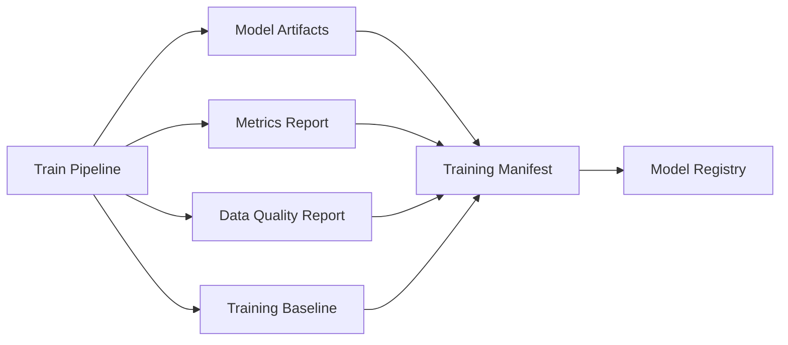
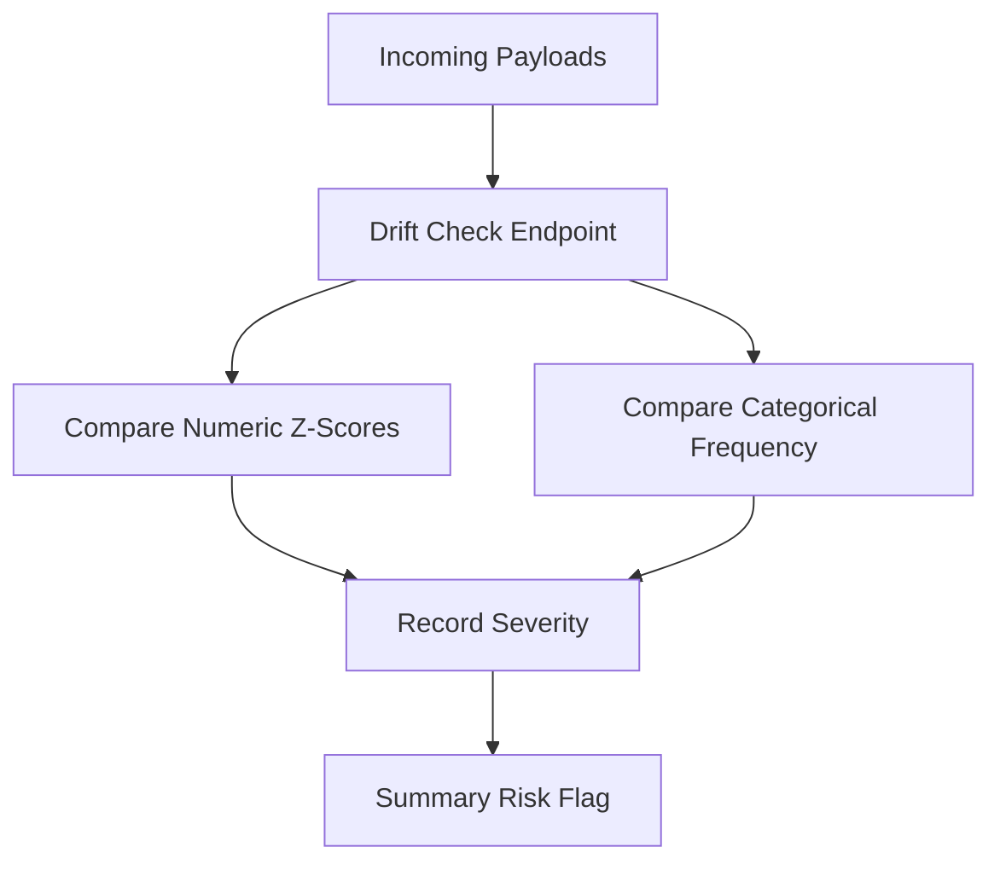
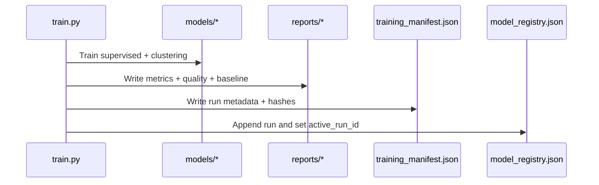
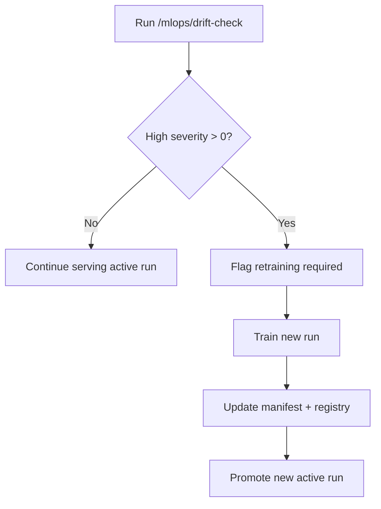

# MLOps Guide - YouTube Success Prediction ML Platform

Below is the MLOps guide for the YouTube Success Prediction ML Platform, detailing artifact management, manifest and registry design, drift operations, and governance best practices.

## Table Of Contents

- [Document Metadata](#document-metadata)
- [Documentation Map](#documentation-map)
- [Dataset Overview](#dataset-overview)
- [Artifact Lifecycle](#artifact-lifecycle)
- [Manifest + Registry](#manifest--registry)
- [Drift Operations](#drift-operations)
- [Training And Registry Update Sequence](#training-and-registry-update-sequence)
- [Drift Response Policy](#drift-response-policy)
- [Readiness Gating](#readiness-gating)
- [Recommended Production Controls](#recommended-production-controls)
- [Governance Checklist](#governance-checklist)

## Document Metadata

| Field | Value |
| --- | --- |
| Document role | MLOps lifecycle, governance, and operational controls |
| Primary audience | ML engineers, MLOps engineers, reliability engineers |
| Last updated | February 18, 2026 |
| Artifact roots | `artifacts/models`, `artifacts/reports`, `artifacts/mlops` |
| Control owner | ML platform governance |

## Documentation Map

| Document | Scope | Use it when |
| --- | --- | --- |
| [`README.md`](README.md) | End-to-end runbook | You need train/test bootstrap operations |
| [`ARCHITECTURE.md`](ARCHITECTURE.md) | Component and data lifecycle context | You need system-level interaction details |
| [`API_REFERENCE.md`](API_REFERENCE.md) | MLOps endpoint contracts | You need drift/manifest/registry API behavior |
| [`DEPLOYMENT.md`](DEPLOYMENT.md) | Promotion and rollout controls | You need release orchestration policy alignment |

## Dataset Overview

MLOps lineage in this project is dataset-aware and records the exact dataset hash used by each training run.

Primary source dataset:

- default file: `data/Global YouTube Statistics.csv`
- canonical source: [Kaggle - Global YouTube Statistics 2023](https://www.kaggle.com/datasets/nelgiriyewithana/global-youtube-statistics-2023?resource=download)
- encoding: `latin-1`
- row count: `995`
- raw columns: `28`

Processed dataset artifact:

- file: `data/global_youtube_statistics_processed.csv`
- row count: `995`
- processed columns: `30`
- includes engineered fields: `age`, `growth_target`

Path resolution behavior (training/runtime):

- resolver: `resolve_data_path()` in `src/youtube_success_ml/data/loader.py`
- default env override: `YTS_DATA_PATH`
- project root override: `YTS_PROJECT_ROOT`
- CI stabilization variables:
  - `YTS_PROJECT_ROOT=${{ github.workspace }}`
  - `YTS_DATA_PATH=${{ github.workspace }}/data/Global YouTube Statistics.csv`
  - `YTS_ARTIFACT_DIR=${{ github.workspace }}/artifacts`

MLOps relevance:

- every manifest captures `data_path` and `data_sha256`
- registry changes (`active_run_id`) should always be interpreted together with dataset fingerprint
- retraining/promotion decisions should verify dataset continuity or explicitly document dataset drift

## Artifact Lifecycle

Generated files:

- `artifacts/models/supervised_bundle.joblib`
- `artifacts/models/clustering_bundle.joblib`
- `artifacts/models/clustered_channels.csv`
- `artifacts/reports/training_metrics.json`
- `artifacts/reports/data_quality_report.json`
- `artifacts/reports/training_baseline.json`
- `artifacts/mlops/training_manifest.json`
- `artifacts/mlops/model_registry.json`

## Manifest + Registry

### Manifest

Tracks immutable evidence for a run:

- run id
- dataset hash
- training config
- metrics snapshot
- artifact hashes and paths

### Registry

Tracks run history and active run pointer:

- `active_run_id`
- chronological run records

## Drift Operations

## Training And Registry Update Sequence

## Drift Response Policy

## Readiness Gating

`/ready` depends on required artifact existence. If any required file is missing, API returns not-ready status.

## Recommended Production Controls

- persist artifact volume with backups
- enforce schema versioning around training + inference contracts
- alert on repeated high-severity drift
- promote model runs through explicit approval workflow

## Governance Checklist

- Ensure `data_sha256` in manifest is tracked for every release.
- Ensure `active_run_id` change is audited.
- Ensure drift checks are executed on recent production payload samples.
- Ensure readiness gates fail closed when artifacts are missing.
