# YouTube Success Prediction ML Platform

<p align="center">
  
</p>

This repository contains a production-oriented machine learning platform for YouTube channel success prediction and intelligence. The system combines:

1. Supervised prediction of channel outcomes.
2. Unsupervised channel archetype discovery.
3. Global analytics and map-ready country/category intelligence.
4. Production API and frontend delivery with MLOps artifacts.
5. Multi-cloud deployment and GitOps strategy.
6. Comprehensive documentation and operational runbooks.
7. Quality gates, testing, and formatting for maintainability.
8. Detailed design and architecture documentation for engineering alignment.

This `README.md` is only the operational entrypoint. For detailed design and subsystem contracts, use the linked documentation map below.


## Table Of Contents

- [Document Metadata](#document-metadata)
- [Documentation Map](#documentation-map)
- [Project Overview](#project-overview)
- [Dataset Overview](#dataset-overview)
- [Implemented Capabilities](#implemented-capabilities)
- [Technology Stack](#technology-stack)
- [Repository Layout](#repository-layout)
- [Quick Start](#quick-start)
- [Environment Configuration](#environment-configuration)
- [End-To-End Pipeline Execution](#end-to-end-pipeline-execution)
- [API Reference](#api-reference)
- [Frontend Reference](#frontend-reference)
- [MLOps And Governance](#mlops-and-governance)
- [Deployment](#deployment)
- [Code Style And Formatting](#code-style-and-formatting)
- [Quality Gates And Testing](#quality-gates-and-testing)
- [Operations Runbook](#operations-runbook)
- [Troubleshooting](#troubleshooting)
- [Detailed Design](#detailed-design)
- [Documentation Governance](#documentation-governance)
- [Documentation Architecture](#documentation-architecture)
- [Production Maturity Checklist](#production-maturity-checklist)

## Document Metadata

This document serves as the operational and product engineering entrypoint for the YouTube Success Prediction ML Platform. It provides a high-level overview of the project, its capabilities, and quick start instructions for setup, execution, and testing. For detailed design, API contracts, MLOps controls, and frontend integration guides, refer to the linked documentation in the map below.

| Field | Value |
| --- | --- |
| Document role | Operational and product engineering entrypoint |
| Primary audience | ML engineers, backend engineers, frontend engineers, DevOps/platform engineers |
| Last updated | February 18, 2026 |
| Canonical architecture reference | [`ARCHITECTURE.md`](ARCHITECTURE.md) |
| Canonical API contract reference | [`API_REFERENCE.md`](API_REFERENCE.md) |

## Documentation Map

This repository contains multiple documentation assets for different audiences and scopes. Use the map below to navigate to the appropriate document based on your current needs.

| Document                                | Scope | Use it when |
|-----------------------------------------| --- | --- |
| [README.md](README.md)                  | Platform entrypoint and runbook | You need setup, execution, and high-level operational flow |
| [ARCHITECTURE.md](ARCHITECTURE.md)      | End-to-end system design | You need component interactions, boundaries, and tradeoffs |
| [API_REFERENCE.md](API_REFERENCE.md)    | Endpoint contracts and payloads | You are building clients or validating API behavior |
| [MLOPS.md](MLOPS.md)                    | Model lineage, drift, governance | You are auditing model lifecycle and risk controls |
| [FRONTEND.md](FRONTEND.md)              | Next.js routing and client integration | You are extending UX, metadata, or chart integrations |
| [DEPLOYMENT.md](DEPLOYMENT.md)          | Delivery, rollout, and cloud runbook | You are shipping releases or changing deployment strategy |
| [infra/README.md](infra/README.md)      | Infra stack navigation | You need infrastructure entrypoints and quick commands |
| [infra/k8s/README.md](infra/k8s/README.md) | Kubernetes manifests and overlays | You are editing cluster runtime resources |
| [infra/argocd/README.md](infra/argocd/README.md) | GitOps strategy apps | You are switching rollout modes in Argo CD |
| [infra/terraform/README.md](infra/terraform/README.md) | Multi-cloud IaC packs | You are provisioning or updating cloud environments |

**Demo Frontend:** [https://youtube-success.vercel.app](https://youtube-success.vercel.app)

## Project Overview

This project is designed as a portfolio-grade ML system with production-oriented structure and workflows. The system accepts high-level channel inputs:

- `uploads`
- `category`
- `country`
- `age`

and returns:

- predicted subscribers
- predicted yearly earnings
- predicted 30-day growth

It also clusters channels into strategic archetypes and produces country-level influence/earnings/category metrics for data storytelling and product UI consumption.

### Dataset Overview

Primary dataset:

- file: `data/Global YouTube Statistics.csv`
- encoding: `latin-1`
- rows: `995`
- columns: `28` (raw source schema)

Processed dataset artifact:

- file: `data/global_youtube_statistics_processed.csv`
- rows: `995`
- columns: `30` (includes engineered `age` and `growth_target`)

Model input contract used by prediction APIs:

- `uploads` (numeric)
- `category` (categorical)
- `country` (categorical)
- `age` (numeric)

Model targets:

- `subscribers`
- `highest_yearly_earnings`
- `growth_target` (derived from `subscribers_for_last_30_days`)

Key preprocessing and cleaning behavior (implemented in `src/youtube_success_ml/data/loader.py`):

- normalizes raw headers to snake_case
- coerces known numeric fields (`errors="coerce"`)
- imputes/fills categorical nulls (`country`, `category`, `abbreviation`)
- derives `age` from `created_year` with non-negative clipping
- derives `growth_target` from 30-day subscriber change
- clips critical numeric features/targets to non-negative values

High-signal source columns represented in the dataset:

| Group | Columns |
| --- | --- |
| Identity and taxonomy | `rank`, `youtuber`, `title`, `channel_type`, `category`, `country`, `abbreviation` |
| Core performance | `uploads`, `subscribers`, `video_views`, `video_views_for_the_last_30_days` |
| Earnings | `lowest_monthly_earnings`, `highest_monthly_earnings`, `lowest_yearly_earnings`, `highest_yearly_earnings` |
| Growth and lifecycle | `subscribers_for_last_30_days`, `created_year`, `created_month`, `created_date`, engineered `age`, engineered `growth_target` |
| Geo and socio-economic context | `latitude`, `longitude`, `population`, `urban_population`, `unemployment_rate`, `gross_tertiary_education_enrollment_pct` |

## Implemented Capabilities

The platform implements the following core capabilities:

### 1) Supervised Prediction

- Models trained for three targets:
  - `subscribers`
  - `highest_yearly_earnings`
  - `growth_target` (derived from `subscribers_for_last_30_days`)
- Shared feature contract:
  - numeric: `uploads`, `age`
  - categorical: `category`, `country`
- Robust preprocessing:
  - missing value handling
  - one-hot encoding with unknown-safe inference
  - log-target transformation for stability
- Advanced prediction operations:
  - batch prediction
  - upload-range what-if simulation
  - strategy recommendations with archetype projection
  - feature importance extraction

### 2) Unsupervised Clustering

- KMeans and DBSCAN pipelines trained on:
  - `uploads`, `subscribers`, `highest_yearly_earnings`, `growth_target`
- Human-readable cluster archetypes assigned programmatically:
  - Viral entertainers
  - Consistent educators
  - High earning low upload
  - High upload low growth
- Cluster profile summaries exposed through API.

### 3) Global Data Visualization Support

- Country-level metrics endpoint for frontend visualization.
- Map asset generation during training:
  - influence map
  - earnings choropleth
  - category dominance map

### 4) API Delivery

- FastAPI service (`src/youtube_success_ml/api/fastapi_app.py`)
- Flask service (`src/youtube_success_ml/api/flask_app.py`)
- Artifact readiness checks and MLOps metadata endpoints.

### 5) Frontend Delivery

- Next.js dashboard (`frontend/`) with:
  - prediction workflow
  - cluster summary
  - country intelligence table
  - dedicated `/visualizations/charts` route with raw vs processed data presentation
  - dedicated `/intelligence/lab` route for advanced model operations and drift-aware analysis

<p align="center">
  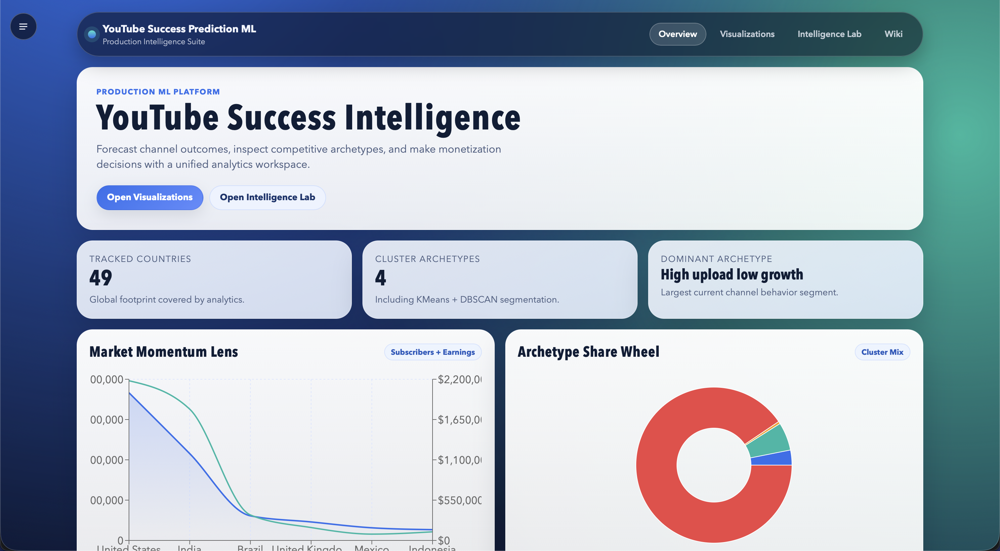
</p>

<p align="center">
  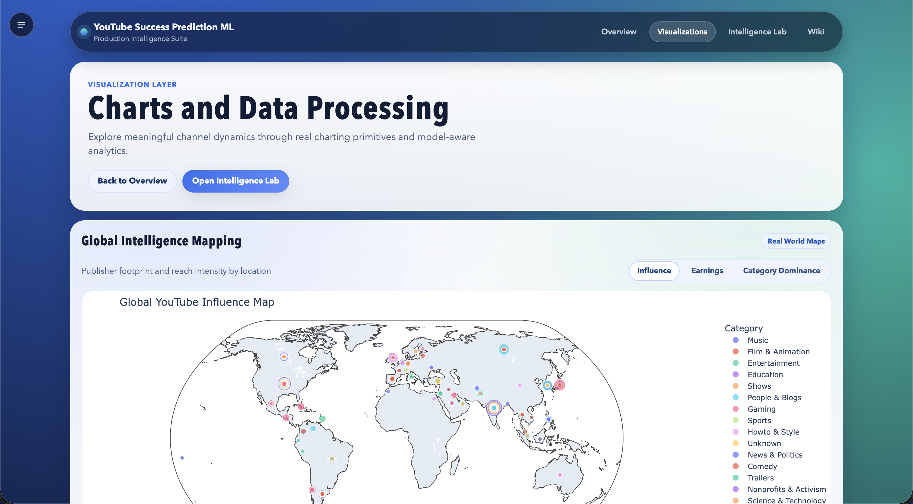
</p>

<p align="center">
  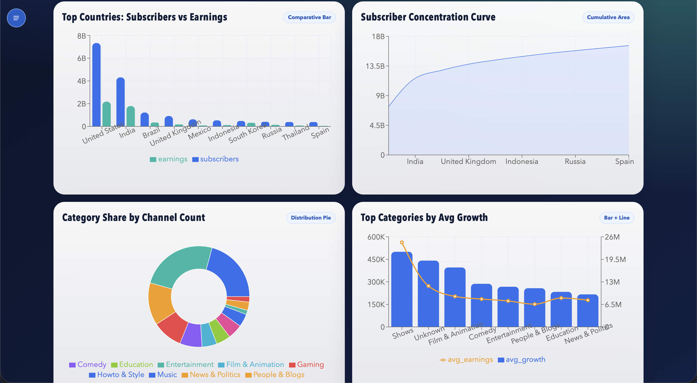
</p>

<p align="center">
  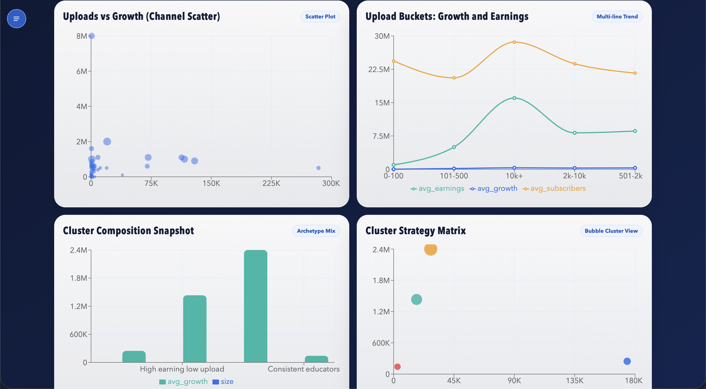
</p>

<p align="center">
  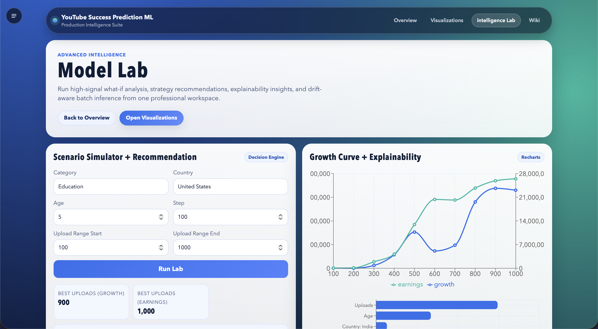
</p>

<p align="center">
  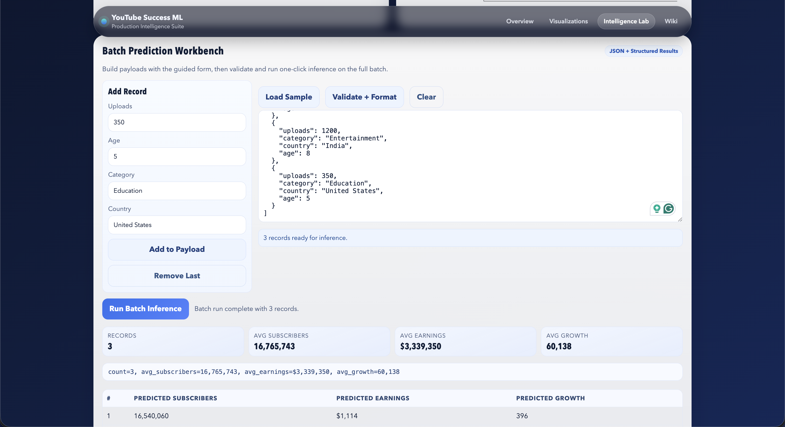
</p>

### 6) MLOps Artifacts

Each training run produces:

- model binaries
- metrics report
- data quality report
- manifest with hash/version metadata
- model registry with active run tracking

### 7) Multi-Cloud Deployment And GitOps

- Kubernetes runtime and strategy overlays (rolling/canary/bluegreen).
- Argo CD application definitions for strategy-controlled deployments.
- Jenkins pipeline for train/test/build/push/deploy automation.
- Terraform cloud packs for AWS, GCP, Azure, and OCI.

## Technology Stack

The platform is built with the following technologies, chosen for their production readiness, ecosystem maturity, and alignment with the project requirements:

### Data And ML

- `pandas`, `numpy`
- `scikit-learn`
- `joblib`

### API And Validation

- `FastAPI`
- `Flask`
- `pydantic`

### Visualization

- `plotly`
- `folium` (optional runtime dependency; plotly fallback supported)

### Frontend

- `Next.js 14`
- `TypeScript`
- Vercel

### DevOps / Delivery

- `pytest`
- `Makefile`
- Docker (`docker/`)
- Docker Compose (`docker-compose.yml`)
- GitHub Actions (`.github/workflows/ci.yml`)
- Jenkins (`Jenkinsfile`)
- Argo CD + Argo Rollouts (`infra/argocd`, `infra/k8s/overlays`)
- Terraform multi-cloud packs (`infra/terraform`)
- Kubernetes Kustomize overlays (`infra/k8s`)
- AWS, Azure, OCI, and GCP support

### GitHub Actions CI/CD

Primary workflow: `.github/workflows/ci.yml`

Pipeline stages and behavior:

1. `🧪 Backend + ML Train/Test`
- installs Python dependencies
- runs full training (`python -m youtube_success_ml.train --run-all`)
- runs test suite (`pytest -q`)
- uploads ML artifacts (`artifacts/**`)
- enforces stable data/artifact paths with:
  - `YTS_PROJECT_ROOT`
  - `YTS_DATA_PATH`
  - `YTS_ARTIFACT_DIR`

2. `🎨 Frontend Lint + Build`
- installs frontend dependencies (`npm ci`)
- runs lint and production build
- uploads frontend build artifacts

3. `🐳 API Image -> GHCR` and `🐳 Frontend Image -> GHCR`
- both jobs wait for backend and frontend quality gates to complete
- both jobs then run in parallel
- images are pushed to:
  - `ghcr.io/<owner>/youtube-success-ml-api:<sha>`
  - `ghcr.io/<owner>/youtube-success-ml-api:latest`
  - `ghcr.io/<owner>/youtube-success-ml-frontend:<sha>`
  - `ghcr.io/<owner>/youtube-success-ml-frontend:latest`
- GHCR publish runs on non-PR events (`push`, `workflow_dispatch`); PR runs skip publish safely

4. `📊 Pipeline Status Report`
- generates GitHub job summary
- posts/updates PR comment with stage statuses
- enforces overall pipeline success (while allowing skipped GHCR jobs on PRs)

Minimal execution graph:

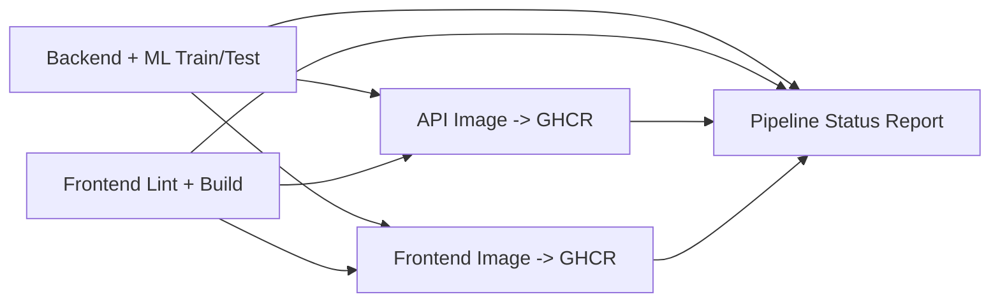

<p align="center">
  
</p>

## Repository Layout

```text
.
|-- src/youtube_success_ml/
|   |-- api/
|   |-- data/
|   |-- mlops/
|   |-- models/
|   |-- services/
|   |-- visualization/
|   |-- config.py
|   `-- train.py
|-- tests/
|-- frontend/
|-- .devcontainer/
|-- data/
|-- artifacts/
|-- docker/
|-- infra/
|-- scripts/
|-- Jenkinsfile
|-- Makefile
`-- docker-compose.yml
```

## Quick Start

### Prerequisites

- Python `>= 3.10`
- Node.js `>= 20` (22 recommended)
- npm

### 0) Dev Container (Recommended)

This repository includes a ready-to-use VS Code/Codespaces dev container:

- config: `.devcontainer/devcontainer.json`
- bootstrap: `.devcontainer/post-create.sh`

Open the repository in VS Code and run: `Dev Containers: Reopen in Container`.

### 1) Python Environment

```bash
python3 -m venv .venv --system-site-packages
source .venv/bin/activate
pip install --no-build-isolation -e .
```

For development dependencies:

```bash
pip install --no-build-isolation -e '.[dev]'
```

### 2) Train Everything

```bash
PYTHONPATH=src python -m youtube_success_ml.train --run-all
```

### 3) Run Tests

```bash
PYTHONPATH=src pytest -q
```

### 4) Start API

FastAPI:

```bash
PYTHONPATH=src uvicorn youtube_success_ml.api.fastapi_app:app --host 0.0.0.0 --port 8000
```

Flask:

```bash
PYTHONPATH=src python -m youtube_success_ml.api.flask_app
```

### 5) Start Frontend

```bash
cd frontend
npm install
npm run dev
```

> [!TIP]
> A demo frontend is also available at [https://youtube-success.vercel.app](https://youtube-success.vercel.app). Only the UI demo is available. For it to be fully functional, please set up the backend API and ML serving locally.

## Environment Configuration

### Training Environment Variables

Supported in `TrainingConfig.from_env()`:

- `YTS_RANDOM_STATE`
- `YTS_TEST_SIZE`
- `YTS_N_ESTIMATORS`
- `YTS_MIN_SAMPLES_LEAF`
- `YTS_N_CLUSTERS`
- `YTS_DBSCAN_EPS`
- `YTS_DBSCAN_MIN_SAMPLES`
- `YTS_MODEL_DIR` (artifact model directory override)

Example:

```bash
export YTS_N_ESTIMATORS=300
export YTS_DBSCAN_EPS=1.1
PYTHONPATH=src python -m youtube_success_ml.train --run-all
```

### Frontend Environment Variables

Create `frontend/.env.local`:

```bash
NEXT_PUBLIC_API_BASE_URL=http://localhost:8000
```

## End-To-End Pipeline Execution

Mermaid overview:

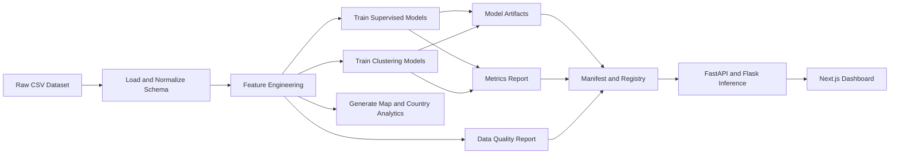

## API Reference

Base URL defaults:

- FastAPI: `http://localhost:8000`
- Flask: `http://localhost:5000`

### Health And Readiness

- `GET /health`
- `GET /ready`

`/ready` returns `503` when required model/report artifacts are missing.

### Prediction

- `POST /predict`
- `POST /predict/batch`
- `POST /predict/simulate`
- `POST /predict/recommendation`
- `GET /predict/feature-importance`

Request:

```json
{
  "uploads": 900,
  "category": "Music",
  "country": "India",
  "age": 8
}
```

Response:

```json
{
  "predicted_subscribers": 25123456.12,
  "predicted_earnings": 5123456.78,
  "predicted_growth": 12345.67
}
```

### Clustering

- `GET /clusters/summary`

Returns cluster-level aggregates and archetype names.

### Country Analytics

- `GET /maps/country-metrics`

Returns country records with total subscribers, earnings, and dominant category.

### Data Samples (Raw vs Processed)

- `GET /data/raw-sample?limit=10`
- `GET /data/processed-sample?limit=10`

Used by frontend visualizations to compare source data and engineered model-ready data.

### MLOps Metadata

- `GET /mlops/manifest`
- `GET /mlops/registry`
- `POST /mlops/drift-check`

### Operational Metrics

- `GET /metrics`

Prometheus-style text output with request count and cumulative latency by path.

## Frontend Reference

Routes:

- `/`
  - prediction form
  - cluster summary table
  - country metrics table
- `/visualizations/charts`
  - chart-driven analytics
  - raw data sample table
  - post-processed data sample table
- `/intelligence/lab`
  - what-if simulator
  - recommendation engine view
  - feature importance table
  - batch inference workbench
  - drift risk snapshot
- `/wiki`
  - embedded project wiki in app shell
  - architecture and operations reference landing page
- `/wiki/index.html`
  - standalone static wiki build

## MLOps And Governance

### Generated Artifacts

- `artifacts/models/supervised_bundle.joblib`
- `artifacts/models/clustering_bundle.joblib`
- `artifacts/models/clustered_channels.csv`
- `artifacts/reports/training_metrics.json`
- `artifacts/reports/data_quality_report.json`
- `artifacts/reports/training_baseline.json`
- `artifacts/mlops/training_manifest.json`
- `artifacts/mlops/model_registry.json`

### Manifest Semantics

Manifest contains:

- `run_id` and UTC timestamp
- platform and python version
- dataset path and `sha256`
- training hyperparameters
- evaluation metrics snapshot
- artifact hashes and paths

### Registry Semantics

Registry maintains:

- all known training runs
- active run id
- artifact paths and training config for each run

This allows deterministic model lineage and rollback decisions.

## Deployment

### Local Runtime

- `make train`
- `make test`
- `make serve-fastapi`
- `make frontend-dev`
- `docker compose up --build`
- `make format-prettier`
- `make format-python`
- `make format-all`

Formatting scripts:

- `scripts/format_prettier.sh`
- `scripts/format_python.sh`
- `scripts/format_all.sh`

Formatter tool bootstrap:

```bash
make install-dev
```

### Production Runtime

The production deployment includes:

- Kubernetes manifests in `infra/k8s/base`.
- Strategy overlays:
  - `infra/k8s/overlays/rolling`
  - `infra/k8s/overlays/canary`
  - `infra/k8s/overlays/bluegreen`
- Argo CD apps and bootstrap scripts in `infra/argocd`.
- Terraform cloud packs in `infra/terraform/environments/{aws,gcp,azure,oci}`.
- Jenkins pipeline in `Jenkinsfile`.

For full production instructions, see `DEPLOYMENT.md`.

## Code Style And Formatting

Repository formatting is standardized for both Python and non-Markdown code.

- Combined formatter command:
  - `make format-all`
- Individual formatter commands:
  - `make format-prettier`
  - `make format-python`
- Formatter setup bootstrap:
  - `make install-dev`

Formatting assets:

- `.prettierrc.json` and `.prettierignore` for Prettier.
- `pyproject.toml` (`[tool.ruff]`) for Python formatting/import sorting.
- `scripts/format_all.sh`, `scripts/format_prettier.sh`, `scripts/format_python.sh`.

## Quality Gates And Testing

Test suite includes:

- dataset loading and schema checks
- supervised training contract
- clustering training contract
- map builder outputs
- API prediction contracts
- API readiness and MLOps endpoint contracts

Run:

```bash
PYTHONPATH=src pytest -q
```

## Operations Runbook

### Full Bootstrap

```bash
source .venv/bin/activate
PYTHONPATH=src python -m youtube_success_ml.train --run-all
PYTHONPATH=src uvicorn youtube_success_ml.api.fastapi_app:app --host 0.0.0.0 --port 8000
```

### API Smoke Test

```bash
bash scripts/smoke_api.sh http://127.0.0.1:8000
```

### Verify Readiness

```bash
curl -i http://127.0.0.1:8000/ready
```

Expected:

- `HTTP 200` and body `ready` when artifacts exist.
- `HTTP 503` when training has not been run.

## Troubleshooting

### `503 Model artifacts unavailable`

Cause:

- APIs started before training artifacts were generated.

Fix:

```bash
PYTHONPATH=src python -m youtube_success_ml.train --run-all
```

### Frontend cannot reach API

Cause:

- `NEXT_PUBLIC_API_BASE_URL` not configured or incorrect.

Fix:

- set `frontend/.env.local` correctly
- restart Next dev server

### Build environment cannot access external package registries

Cause:

- offline or restricted network environment.

Fix:

- use pre-provisioned dependencies
- avoid pinning to unavailable external services at build time

## Detailed Design

See [ARCHITECTURE.md](ARCHITECTURE.md) for:

- component-level design
- training/inference sequence diagrams
- data contracts
- reliability and failure-mode analysis

### Capability Map

```mermaid
flowchart TD
    A[YouTube Success Prediction ML Platform] --> B[Prediction Engine]
    A --> C[Channel Clustering]
    A --> D[Global Intelligence]
    A --> E[MLOps and Observability]
    A --> F[Frontend Product Experience]

    B --> B1[Single prediction]
    B --> B2[Batch prediction]
    B --> B3[Scenario simulation]
    B --> B4[Recommendations]
    B --> B5[Feature importance]

    C --> C1[KMeans archetypes]
    C --> C2[DBSCAN segmentation]
    C --> C3[Cluster profile summaries]

    D --> D1[Country metrics]
    D --> D2[Raw vs processed samples]
    D --> D3[Map export assets]

    E --> E1[Health and readiness]
    E --> E2[Manifest and registry]
    E --> E3[Drift checks]
    E --> E4[Prometheus metrics]

    F --> F1[Main dashboard]
    F --> F2[Charts page]
    F --> F3[Intelligence Lab]
```

### Product Journey

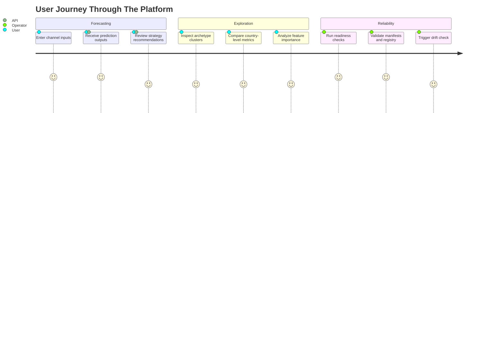

### Service State Model

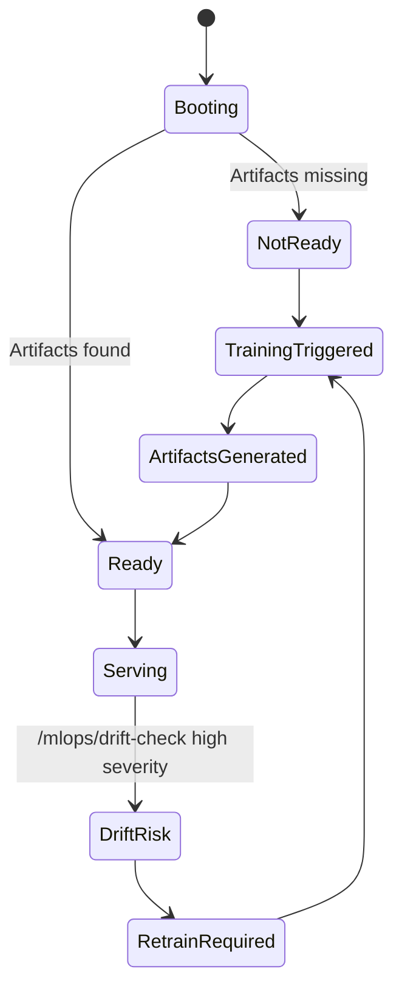

## Documentation Governance

The documentation set is maintained as an engineering artifact, not post-facto notes. Any change to API contracts, data contracts, rollout behavior, or frontend route topology should include synchronized documentation updates in the same pull request.

Release documentation requirements:

- Update `README.md` for operator-facing behavior changes.
- Update `ARCHITECTURE.md` for component boundaries, data flow, or topology changes.
- Update `API_REFERENCE.md` for endpoint additions/removals/shape changes.
- Update `MLOPS.md` for lineage, registry, drift, or promotion policy changes.
- Update infra docs for Kubernetes, Argo CD, or Terraform control-plane changes.

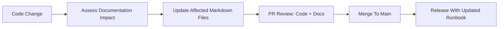

## Documentation Architecture

The documentation set is intentionally layered. Start from `README.md` for operations, then drill into subsystem docs.

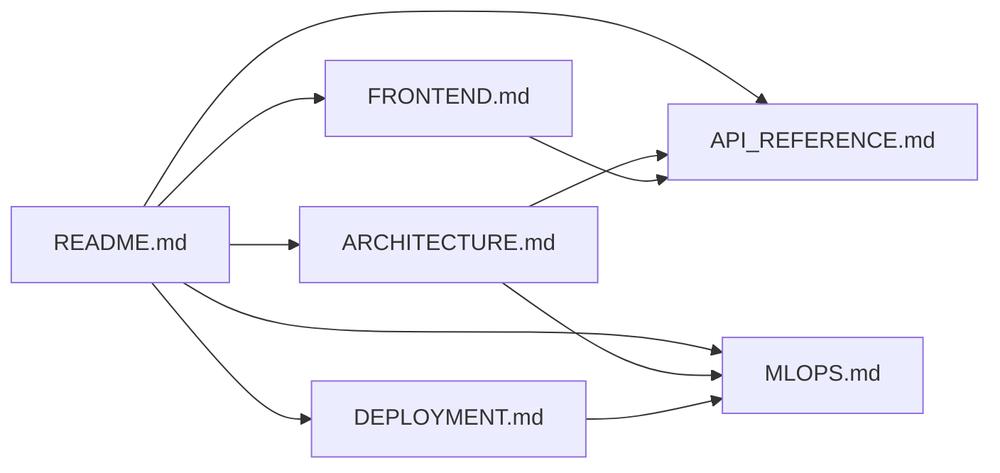

## Production Maturity Checklist

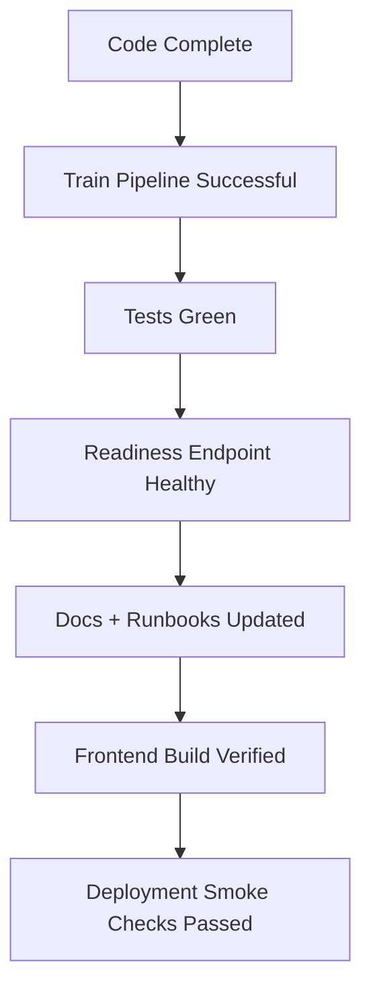

A release is considered production-ready only when all nodes above are complete.
